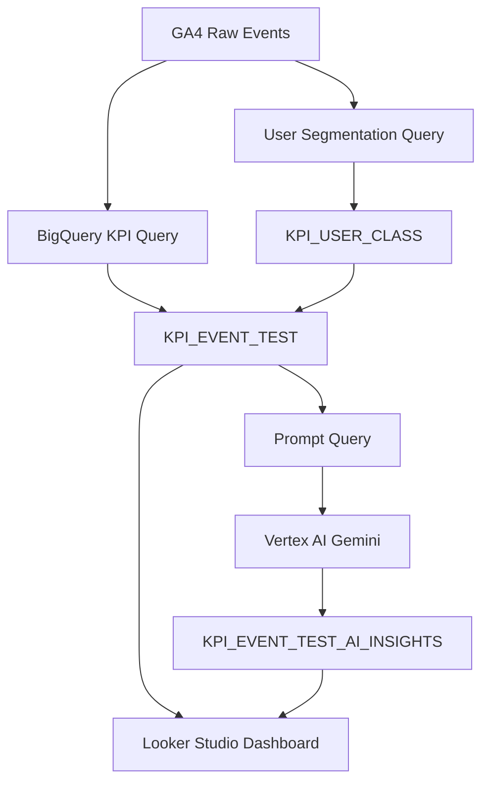

# Marketing KPI AI Insight Dashboard

GA4 BigQuery 데이터를 기반으로 이벤트별 마케팅 성과를 자동 집계하고, Vertex AI를 활용해 실행 액션 중심의 인사이트를 생성하는 마케팅 KPI 분석 대시보드 프로젝트입니다.

단순히 수치를 보여주는 리포트가 아니라, 각 이벤트가 현재 어떤 역할을 하고 있는지, 어떤 문제가 있는지, 앞으로 어떤 액션을 취해야 하는지를 빠르게 판단할 수 있도록 설계했습니다.

> 보안상 실제 운영 SQL, Python 코드, GCP 설정값, 인증 정보는 공개하지 않습니다.  
> 본 저장소는 프로젝트 구조, 분석 설계, 테이블 구조, 시각화 결과 중심의 포트폴리오 저장소입니다.

---

## 1. 프로젝트 배경

마케팅 이벤트 페이지는 유입, 참여, 구매, 매출 성과가 각각 다르게 나타납니다.

기존에는 이벤트별 성과를 수동으로 확인해야 했고, 다음과 같은 문제가 있었습니다.

- 이벤트별 유입은 많지만 구매로 이어지는지 즉시 판단하기 어려움
- 3개월, 1개월, 주차별 성과 흐름을 한눈에 보기 어려움
- 이벤트가 유입용인지, 구매 전환용인지, 참여 유도용인지 구분하기 어려움
- 데이터는 많지만 실제 액션으로 연결되는 해석이 부족함
- 담당자가 매번 수동으로 인사이트를 작성해야 함

이 프로젝트는 이러한 문제를 해결하기 위해 BigQuery, Cloud Run, Vertex AI, Looker Studio를 연결하여 자동화된 마케팅 성과 분석 시스템을 구축한 것입니다.

---

## 2. 프로젝트 목표

이 프로젝트의 목표는 다음과 같습니다.

1. GA4 이벤트 데이터를 기반으로 이벤트별 KPI 자동 생성
2. 3개월, 1개월, 주차 단위의 성과 흐름 비교
3. 유입, 구매전환, 참여전환, 매출, 객단가를 기준으로 이벤트 포지션 분석
4. 유저 군집 분석을 통해 이벤트별 방문자 특성 파악
5. Vertex AI를 활용해 이벤트별 요약과 실행 액션 자동 생성
6. Looker Studio에서 실무자가 바로 확인할 수 있는 대시보드 구성

---

## 3. 전체 시스템 구조



---

## 4. 사용 기술

| 구분 | 사용 기술 |
|---|---|
| 데이터 소스 | GA4 Export |
| 데이터 웨어하우스 | BigQuery |
| 데이터 처리 | BigQuery SQL |
| AI 인사이트 생성 | Vertex AI Gemini |
| 자동화 실행 | Cloud Run Jobs |
| 스케줄링 | Cloud Scheduler |
| 시각화 | Looker Studio |
| 컨테이너 | Docker, Artifact Registry |
| 언어 | Python |

---

## 5. 대시보드 예시

### 5.1 이벤트 성과 대시보드


위 대시보드는 이벤트별 성과를 버블 차트와 테이블로 보여줍니다.

- X축: 페이지 반응 또는 전환 관련 지표
- Y축: 구매전환 또는 참여전환 지표
- 버블 크기: 유입 또는 매출 규모
- 색상: 이벤트 성과 유형 또는 추천 액션
- 필터: 기간, 이벤트코드, 생성일자

---

### 5.2 이벤트 포지션 분석


각 이벤트는 평균값을 기준으로 사분면에 배치됩니다.

| 구분 | 의미 |
|---|---|
| 페이지 반응 높음 + 구매전환 높음 | 핵심 성과 이벤트 |
| 페이지 반응 높음 + 구매전환 낮음 | 관심은 있으나 구매 설득 부족 |
| 페이지 반응 낮음 + 구매전환 높음 | 목적 구매 성향 |
| 페이지 반응 낮음 + 구매전환 낮음 | 개선 또는 종료 검토 필요 |

---

### 5.3 AI 인사이트 예시


AI 인사이트는 이벤트별로 다음 내용을 생성합니다.

- 짧은 요약 제목
- 현재 성과 위치
- 기간별 흐름 변화
- 문제 가능성
- 다음 실행 액션

예시:

```text
요약: 관심은 높지만 구매는 없음

인사이트:
사람들이 많이 둘러보고 다른 이벤트로도 잘 넘어간다.
하지만 구매로는 전혀 이어지지 않고, 관망형 유저 비중이 높은 편이다.
이벤트의 핵심 혜택을 더 명확히 보여주고, 기간 한정 프로모션을 추가해 구매를 유도해야 한다.
```
