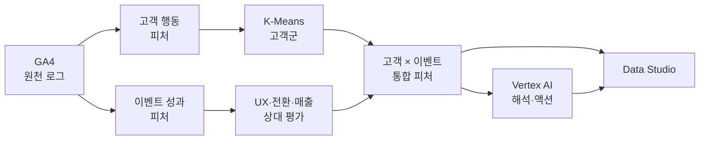
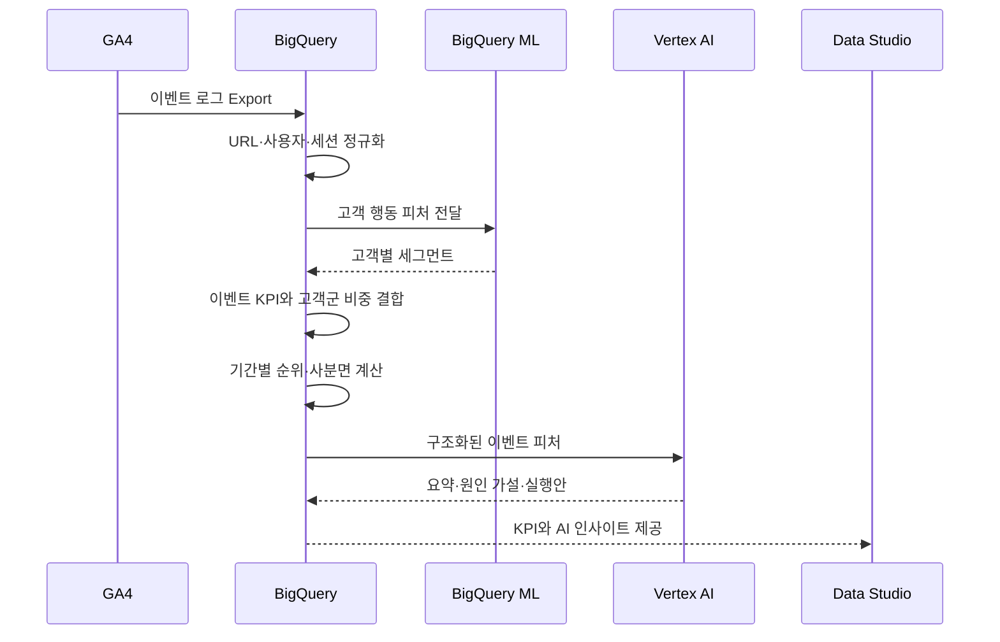

# GA4 행동 로그 기반 이벤트 마케팅 의사결정 시스템

**고객 행동 분석 · 이벤트 성과 진단 · 생성형 AI 액션 제안**

  
  
  
  
  

OOO 교육기업 데이터를 기반으로 구현한 프로젝트입니다. 공개 문서에서는 기업명, 프로젝트 ID, 사업부 코드와 사용자 식별 정보를 비식별화했습니다.

---

## 프로젝트 개요

GA4 로그에서 **고객 행동과 이벤트 성과를 각각 분석하고 결합**한 뒤,  
AI가 이벤트별 성과 원인과 다음 액션을 제안하는 마케팅 의사결정 시스템입니다.

| 기존 리포트 문제 | 분석 구조 개선 | AI 의사결정 지원 |
|:---:|:---:|:---:|
| 유입·매출·전환을 개별 확인 | 고객 행동과 이벤트 성과를 결합 | 근거·원인·액션을 자연어로 제공 |
| ↓ | ↓ | ↓ |
| **숫자의 의미를 사람이 재분석** | **이벤트의 역할과 고객 맥락 진단** | **검증 가능한 다음 액션 제안** |

[설계 과정과 기술적 의사결정 보기 →](docs/implementation.md)

 

## 대시보드 Before / After

### 기존 화면

  

유입·매출·전환율을 각각 확인해야 해 이벤트 비교와 우선순위 선정이 어려웠습니다.

### 개선 화면

  

  

UX, 전환, 규모, 성과 유형과 추천 액션을 한 화면에서 비교합니다.

---

## 한눈에 보기

### 아키텍처

```mermaid
flowchart LR
    A["GA4<br/>원천 로그"] --> B["고객 행동<br/>피처"]
    A --> C["이벤트 성과<br/>피처"]
    B --> D["K-Means<br/>고객군"]
    C --> E["UX·전환·매출<br/>상대 평가"]
    D --> F["고객 × 이벤트<br/>통합 피처"]
    E --> F
    F --> G["Vertex AI<br/>해석·액션"]
    F --> H["Data Studio"]
    G --> H
```

> 고객군과 이벤트 성과를 따로 분석한 뒤 다시 결합해,  
> **무슨 일이 발생했는지뿐 아니라 왜 발생했는지**까지 설명합니다.

 

### 분석 파이프라인

```mermaid
sequenceDiagram
    participant G as GA4
    participant B as BigQuery
    participant M as BigQuery ML
    participant V as Vertex AI
    participant L as Data Studio

    G->>B: 이벤트 로그 Export
    B->>B: URL·사용자·세션 정규화
    B->>M: 고객 행동 피처 전달
    M-->>B: 고객별 세그먼트
    B->>B: 이벤트 KPI와 고객군 비중 결합
    B->>B: 기간별 순위·사분면 계산
    B->>V: 구조화된 이벤트 피처
    V-->>B: 요약·원인 가설·실행안
    B-->>L: KPI와 AI 인사이트 제공
```

[전체 시스템과 데이터 구조 보기 →](docs/architecture.md)

  

--- 
### 핵심 분석 단계

고객과 이벤트를 각각 분석한 뒤 결합하고, 검증된 피처만 AI 해석에 사용했습니다.

| 👤 고객 이해 | 📊 이벤트 평가 | 🔗 데이터 결합 | 🤖 AI 해석 |
|:---:|:---:|:---:|:---:|
| 클릭·체류·스크롤·구매 행동을 피처화 | UX·전환·매출을 기간별 상대 평가 | 이벤트 KPI와 고객군 구성비 결합 | 원인·액션·확인 KPI 생성 |

> **고객 행동 + 이벤트 성과 + 기간별 상대 순위 + 구매·참여 사분면 → 최종 Event Feature**

AI에는 원천 로그가 아닌 SQL로 계산·검증된 Event Feature만 전달합니다.

[고객 피처부터 AI 프롬프트까지 전체 방법론 보기 →](docs/methodology.md)

 

---

## 프로젝트 성과

| 🎯 우선순위 판단 | 🔍 성과 원인 해석 | ⚡ 실행 연결 |
|:---:|:---:|:---:|
| 확대·개선·종료 검토 이벤트 구분 | 고객 성향과 이벤트 성과를 함께 분석 | AI가 다음 액션과 확인 KPI 제안 |

### 만들어진 변화

- 유입은 많지만 구매가 약한 **전환 병목 이벤트 식별**
- 구매형·탐색형 이벤트를 **서로 다른 역할로 평가**
- 3개월·1개월·주차 흐름으로 **성과 상승·하락 신호 감지**
- 반복적인 성과 해석을 **구조화된 AI 인사이트로 자동화**
- 여러 리포트의 정보를 **하나의 의사결정 화면으로 통합**

---

## 👤 My Contribution

| 영역 | 담당 |
|---|---|
| 👤 **Behavior Data** | GA4 원천 로그를 사용자·세션·이벤트 단위로 정규화 |
| 🧩 **Feature Engineering** | 클릭·체류·스크롤·구매 행동을 고객 행동 피처로 설계 |
| 🎯 **Segmentation** | BigQuery ML K-Means 기반 고객 세그먼트 생성 |
| 🔗 **Feature Integration** | 고객군과 이벤트 성과 지표를 결합한 통합 분석 피처 구성 |
| 🤖 **AI Analysis** | SQL로 검증된 Event Feature를 AI 컨텍스트로 구성 |
| 💡 **Insight** | Vertex AI 기반 성과 원인 분석 및 실행 액션 생성 |
| 📊 **Analytics Product** | 고객 행동·이벤트 성과·AI 인사이트를 하나의 분석 화면으로 연결 |
