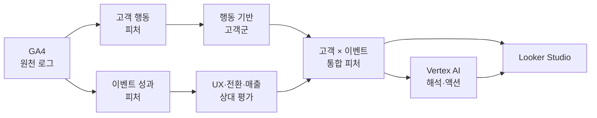

<div align="center">

# Event Intelligence

### GA4 행동 로그를 “다음 마케팅 액션”으로 바꾸는 분석 시스템

**고객 행동 피처 × 이벤트 성과 피처 × 생성형 AI 인사이트**

<p>
  
  
  
  
  
</p>

</div>

---

## 숫자는 많았지만, 답은 없었습니다

기존 리포트는 이벤트별 유입·매출·전환율을 보여줬지만  
**어떤 이벤트를 키우고, 무엇을 고쳐야 하는지**는 사람이 다시 해석해야 했습니다.

그래서 GA4 원천 로그로 고객과 이벤트의 특징을 각각 만들고, 두 데이터를 결합해 이벤트의 역할과 성과를 진단한 뒤, AI가 **성과의 이유와 다음 액션**을 설명하는 구조를 설계했습니다.

> “매출이 낮다”에서 끝나지 않습니다.  
> **유입은 충분하지만 관망 성향 고객이 많고 구매 전환이 낮으므로, 혜택과 CTA를 우선 개선한다**까지 연결합니다.

---

## Before → After

### 기존 방식

<p align="center">
  
</p>

이벤트별 유입, 매출, 전환율을 각각 확인해야 했고, 성과가 좋은 이벤트와 개선이 필요한 이벤트를 빠르게 구분하기 어려웠습니다.

### 구축 후

<p align="center">
  
</p>

UX 상호작용 점수와 전환율을 한 화면에서 비교하고, 버블 크기와 색상으로 이벤트의 규모·성과 유형·추천 액션을 함께 확인하도록 개선했습니다.

---

## 한눈에 보는 프로젝트


```mermaid
flowchart LR
    A["GA4<br/>원천 로그"] --> B["고객 행동<br/>피처"]
    A --> C["이벤트 성과<br/>피처"]
    B --> D["행동 기반<br/>고객군"]
    C --> E["UX·전환·매출<br/>상대 평가"]
    D --> F["고객 × 이벤트<br/>통합 피처"]
    E --> F
    F --> G["Vertex AI<br/>해석·액션"]
    F --> H["Looker Studio"]
    G --> H
```

고객과 이벤트를 독립적으로 분석한 뒤 하나의 의사결정 피처로 합치는 것이 이 프로젝트의 핵심입니다.  
[전체 시스템과 데이터 흐름 자세히 보기 →](docs/architecture.md)

---

## 결과 화면

### 매출 관점

<p align="center">
  
</p>

유입뿐 아니라 매출과 구매자당 평균 매출을 기준으로 이벤트의 확장 가능성과 수익성을 비교합니다.

### 이벤트 비교 화면

<p align="center">
  
</p>

기간, 이벤트 코드, 유입·매출 순위 조건을 적용해 비교 대상을 좁히고 이벤트별 상대 위치를 확인합니다.

이 화면은 다음 질문에 답하도록 구성했습니다.

| Scale | Quality | Conversion | Audience | Action |
|:---:|:---:|:---:|:---:|:---:|
| 유입·매출 규모 | 콘텐츠 반응 | 구매·참여 전환 | 방문 고객 성향 | 확대·개선 우선순위 |

---

## 어떻게 만들었나

### 1. 페이지뷰가 아닌 ‘행동 맥락’을 피처로 만들었습니다

세션별 클릭, 체류, 스크롤, 영상·파일 행동, 경로 깊이, 재방문, 구매와 매출을 집계했습니다. 사용자 선호 시간은 `sin/cos`로 변환해 23시와 0시가 멀어지는 문제를 피했습니다.

[행동 피처 생성 과정 자세히 보기 →](docs/methodology.md#1-고객-행동-피처-생성)

### 2. 행동이 비슷한 고객을 그룹화했습니다

BigQuery ML K-Means로 고객군을 만들고, 가장 큰 군집은 한 번 더 나눴습니다. 한 개의 대형 군집이 서로 다른 행동 패턴을 삼키는 문제를 보완하기 위한 선택입니다.

군집 번호 자체에는 의미가 없기 때문에 군집별 구매·매출·충성도·탐색 프로필을 Vertex AI에 전달해 사람이 이해할 수 있는 고객군 이름으로 변환했습니다.

[계층형 고객 군집과 AI 명명 방식 보기 →](docs/methodology.md#2-행동-기반-고객군-생성)

### 3. 이벤트마다 별도의 성과 피처를 만들었습니다

3개월·1개월·주차별로 유입, 행동, 구매, 참여, 매출을 집계했습니다. 클릭·체류·스크롤처럼 단위가 다른 행동은 0–100으로 정규화해 UX Score로 통합했습니다.

구매만 보면 상단 퍼널 이벤트가 실패로 보일 수 있어, 구매 전환과 회원가입·다음 여정을 포함한 참여 전환을 분리했습니다.

[이벤트 피처와 UX Score 계산 방식 보기 →](docs/methodology.md#3-이벤트-성과-피처-생성)

### 4. 고객군과 이벤트 성과를 다시 합쳤습니다

고객군 정보를 이벤트 방문 데이터에 연결해 이벤트별 고객군 구성비를 계산했습니다.

```text
이벤트 성과
  + 고객군 구성
  + 전체 이벤트 내 순위
  + 구매·참여 사분면
  + 3개월·1개월·주차 흐름
  = 최종 Event Feature
```

따라서 “전환율이 낮다”뿐 아니라 “어떤 성향의 고객이 유입됐고, 어느 단계에서 성과가 약한가”까지 설명할 수 있습니다.

[고객과 이벤트 결합 과정 보기 →](docs/methodology.md#4-고객군과-이벤트-결합)

### 5. 이벤트를 좋다·나쁘다가 아닌 ‘역할’로 진단했습니다

같은 기간 전체 이벤트의 평균을 기준으로 `UX × 구매 전환`, `UX × 참여 전환` 사분면을 만들었습니다.

| 진단 | 해석 | 기본 액션 |
|---|---|---|
| UX ↑ · 구매 ↑ | 경험과 매출이 모두 검증됨 | 예산 집중 |
| UX ↑ · 구매 ↓ | 관심은 높지만 구매 설득이 약함 | 혜택·CTA 강화 |
| UX ↓ · 구매 ↑ | 목적 구매가 강하고 탐색 경험은 약함 | 단가·구성 최적화 |
| UX ↓ · 구매 ↓ | 경험과 전환이 모두 약함 | 개편 또는 종료 검토 |

[왜 절대 기준이 아닌 상대 평가를 선택했는지 보기 →](docs/implementation.md#5-절대-기준이-아닌-기간별-상대-평가)

### 6. AI는 계산하지 않고 해석하게 했습니다

KPI, 순위, 사분면, 고객 구성, 기간 추세는 SQL이 계산합니다. AI는 검증된 피처만 받아 **관찰 → 비교 → 원인 가설 → 액션 → 확인 KPI** 순서로 답하게 했습니다.

```text
[관찰] UX는 평균 이상, 구매 전환은 평균 이하
[고객] 탐색형 고객 비중이 높음
[해석] 관심이 결제로 연결되지 않는 구간 존재
[액션] 가격 할인보다 혜택 명료성과 CTA를 먼저 테스트
[검증] 결제 시작률과 구매 전환율 추적
```

[AI에 전달한 입력과 프롬프트 설계 보기 →](docs/methodology.md#6-ai-해석과-프롬프트-설계)

---

## 왜 이렇게 설계했나

이 프로젝트에서는 단순히 기술을 연결하는 것보다 **어떤 책임을 어디에 둘 것인가**를 중요하게 봤습니다.

- 고객군은 매일 크게 변하지 않아 분기별로 갱신하고, 이벤트 KPI는 매일 갱신
- 이벤트마다 역할이 다르므로 구매 전환과 참여 전환을 분리
- 정확한 계산은 SQL, 비즈니스 언어 해석은 AI가 담당
- 개인 수준 데이터는 최종 화면에 노출하지 않고 이벤트별 고객군 비중으로 집계
- 절대 수치보다 같은 기간 전체 이벤트 안에서의 상대 위치를 함께 제공

[구축 과정과 기술적 의사결정 전체 보기 →](docs/implementation.md)

---

## 이 프로젝트가 보여주는 역량

**GA4 로그 해석 · BigQuery SQL · 데이터 모델링 · 행동 피처 엔지니어링 · 비지도학습 · KPI 설계 · 생성형 AI 제품화 · 대시보드 스토리텔링**

단순한 리포트가 아니라,

> **원천 로그 → 고객 이해 → 이벤트 평가 → AI 해석 → 실행 의사결정**

으로 이어지는 분석 제품 전체를 설계했습니다.

<sub>OOO 교육기업의 데이터를 기반으로 구현한 프로젝트입니다. 공개 문서에서는 기업명, 프로젝트 ID, 사업부 코드와 사용자 식별 정보를 비식별화했습니다.</sub>
