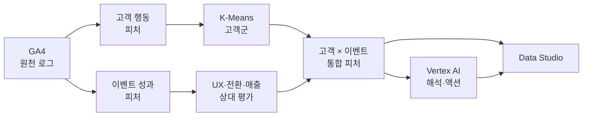
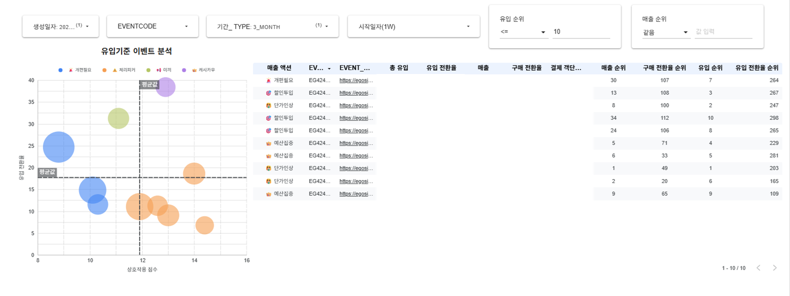
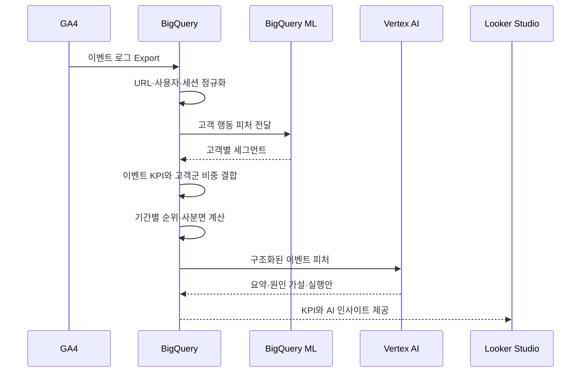
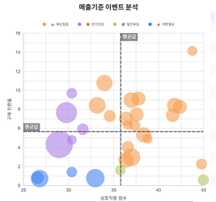

<div align="center">

# Event Intelligence

### GA4 행동 로그 기반 이벤트 마케팅 의사결정 시스템

**고객 행동 분석 · 이벤트 성과 진단 · 생성형 AI 액션 제안**

<p>
  
  
  
  
  
</p>

</div>

---

## 프로젝트 개요

GA4 로그에서 **고객 행동과 이벤트 성과를 각각 분석하고 결합**한 뒤,  
AI가 이벤트별 성과 원인과 다음 액션을 제안하는 마케팅 의사결정 시스템입니다.

| 기존 리포트 문제 | 분석 구조 개선 | AI 의사결정 지원 |
|:---:|:---:|:---:|
| 유입·매출·전환을 개별 확인 | 고객 행동과 이벤트 성과를 결합 | 근거·원인·액션을 자연어로 제공 |
| ↓ | ↓ | ↓ |
| **숫자의 의미를 사람이 재분석** | **이벤트의 역할과 고객 맥락 진단** | **검증 가능한 다음 액션 제안** |


[설계 과정과 기술적 의사결정 보기 →](docs/implementation.md)

## 한눈에 보기

### 아키텍처


```mermaid
flowchart LR
    A["GA4<br/>원천 로그"] --> B["고객 행동<br/>피처"]
    A --> C["이벤트 성과<br/>피처"]
    B --> D["K-Means<br/>고객군"]
    C --> E["UX·전환·매출<br/>상대 평가"]
    D --> F["고객 × 이벤트<br/>통합 피처"]
    E --> F
    F --> G["Vertex AI<br/>해석·액션"]
    F --> H["Data Studio"]
    G --> H
```

> 고객군과 이벤트 성과를 따로 분석한 뒤 다시 결합해,  
> **무슨 일이 발생했는지뿐 아니라 왜 발생했는지**까지 설명합니다.

[전체 시스템과 데이터 구조 보기 →](docs/architecture.md)

---

## Before / After

### 기존 화면

<p align="center">
  
</p>

유입·매출·전환율을 각각 확인해야 해 이벤트 비교와 우선순위 선정이 어려웠습니다.

### 개선 화면

<p align="center">
  
</p>

UX, 전환, 규모, 성과 유형과 추천 액션을 한 화면에서 비교합니다.

---

## 분석 파이프라인


```mermaid
sequenceDiagram
    participant G as GA4
    participant B as BigQuery
    participant M as BigQuery ML
    participant V as Vertex AI
    participant L as Looker Studio

    G->>B: 이벤트 로그 Export
    B->>B: URL·사용자·세션 정규화
    B->>M: 고객 행동 피처 전달
    M-->>B: 고객별 세그먼트
    B->>B: 이벤트 KPI와 고객군 비중 결합
    B->>B: 기간별 순위·사분면 계산
    B->>V: 구조화된 이벤트 피처
    V-->>B: 요약·원인 가설·실행안
    B-->>L: KPI와 AI 인사이트 제공
```

| 01. 고객 | 02. 이벤트 | 03. 결합 | 04. AI |
|:---:|:---:|:---:|:---:|
| 클릭·체류·스크롤·구매 행동을 피처화 | UX·전환·매출을 기간별 상대 평가 | 이벤트별 고객군 구성과 KPI 결합 | 원인·액션·확인 KPI 생성 |

```text
고객 행동
   +
이벤트 성과
   +
기간별 상대 순위
   +
구매·참여 사분면
   =
최종 Event Feature
```

AI에는 원천 로그가 아닌 검증된 Event Feature만 전달합니다.

[고객 피처부터 AI 프롬프트까지 전체 방법론 보기 →](docs/methodology.md)


---

## 대시보드

### 매출 관점

<p align="center">
  
</p>

매출과 구매자당 평균 매출을 기준으로 이벤트의 수익성과 확장 가능성을 비교합니다.

### 이벤트 비교

<p align="center">
  
</p>

기간·이벤트·성과 순위 필터를 이용해 이벤트의 상대적 위치를 확인합니다.

---

## 프로젝트 결과

| 판단 속도 | 분석 깊이 | 실행 연결 |
|:---:|:---:|:---:|
| 여러 리포트를 하나의 화면으로 통합 | 고객 성향과 이벤트 성과를 함께 해석 | AI가 우선 액션과 확인 KPI 제안 |

- 확대할 이벤트와 개선할 이벤트 구분
- 유입은 많지만 구매가 약한 전환 병목 발견
- 구매형·탐색형 이벤트를 서로 다른 기준으로 평가
- 장기·단기·주차 흐름을 이용해 성과 변화 감지
- 반복적인 성과 해석을 구조화된 AI 인사이트로 자동화

---

## 확장 가능성

이 프로젝트를 통해 얻은 핵심 경험은 특정 모델의 사용법이 아니라,  
**흩어진 데이터를 현업의 판단 과정에 맞는 제품으로 연결하는 방법**입니다.

```text
반복 보고 업무
    → 자동화 가능한 데이터 파이프라인

분리된 고객·매출 데이터
    → 실행 가능한 마케팅 가설

복잡한 분석 결과
    → 현업이 사용할 수 있는 대시보드

생성형 AI
    → 근거와 검증 기준을 갖춘 의사결정 기능
```

> **데이터를 보여주는 것에서 끝내지 않고, 다음 행동을 결정할 수 있는 구조를 만듭니다.**

<sub>OOO 교육기업 데이터를 기반으로 구현한 프로젝트입니다. 공개 문서에서는 기업명, 프로젝트 ID, 사업부 코드와 사용자 식별 정보를 비식별화했습니다.</sub>

