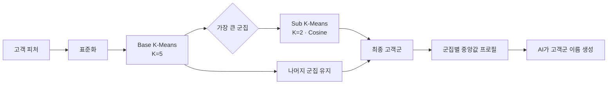

# 분석 로직

> 고객의 행동을 설명하는 피처와 이벤트의 성과를 설명하는 피처를 각각 만든 뒤 결합합니다.

[← 메인 README로 돌아가기](../README.md)

---

## 1. 고객 행동 피처

GA4 이벤트를 `unified_user_id × session_id × event_code` 단위로 집계합니다.

### 식별과 전처리

- `user_id`가 있으면 우선 사용하고, 없으면 `user_pseudo_id`로 보완
- 분석 기간은 직전 분기 시작일부터 종료일까지 설정
- 체류시간 3초 미만 또는 5,400초 초과 세션은 군집 입력에서 제외
- 구매·매출·세션·행동량은 `LOG10(x + 1)`로 변환해 긴 꼬리 분포 완화
- 선호 시간은 `sin/cos` 순환형 피처로 변환

### 주요 입력 피처

| 관점 | 피처 예시 |
|---|---|
| 가치 | 구매 횟수, 누적 매출 |
| 충성도 | 활동 일수, 총 세션 수, 재진입 횟수 |
| 탐색 | 행동 수, 클릭 수, 경로 깊이 |
| 콘텐츠 반응 | 스크롤 깊이, 체류시간, 스크롤 효율 |
| 의도 | 상품조회·장바구니·결제 시작·구매 행동 비율 |
| 맥락 | 신규 고객 여부, 랜딩 비율, 선호 시간 |

두 개의 보조 지표도 계산합니다.

```text
IDS = (스크롤 + 클릭 + 영상 재생 + 파일 다운로드) / 체류시간
ISS = 의도 행동 수 / 전체 행동 수
```

`IDS`는 제한된 시간 안의 상호작용 밀도, `ISS`는 행동 중 구매 의도 신호가 차지하는 비율을 나타냅니다.

## 2. 계층형 고객 군집



한 개의 대형 군집이 서로 다른 다수 고객 행동을 뭉뚱그리지 않도록 가장 큰 Base 군집만 추가 분할합니다. 최종 그룹 번호는 다시 연속된 값으로 매핑합니다.

군집명은 고정 라벨이 아닙니다. 구매, 매출, 충성도, 탐색 깊이, 체류, IDS·ISS 등의 군집별 중앙값 프로필을 바탕으로 생성하며, 데이터가 달라지면 이름도 다시 평가할 수 있습니다.

## 3. 이벤트 행동과 KPI

### 이벤트 URL 복원

실제 운영 로그에는 인코딩된 URL, 로그인 페이지의 `return_url`, 프로모션 서버 접두어 등이 섞일 수 있습니다. URL을 디코딩·복원한 뒤 정규식으로 이벤트 코드를 추출하고 이벤트 메타데이터와 연결합니다.

### 기간 창

| 코드 | 의미 |
|---|---|
| `3_MONTH` | 최근 장기 흐름 |
| `1_MONTH` | 이번 달 단기 성과 |
| `1_WEEK` | 주차별 변화 |

각 기간에서 이벤트별 사용자, 구매자, 회원가입, 다음 여정, 매출, 객단가와 행동 평균을 계산합니다.

### UX Score

행동 지표는 단위가 서로 다르므로 같은 기간의 이벤트 사이에서 Min-Max 정규화합니다.

```text
행동 = 평균(행동 수, 클릭, 영상 재생, 파일 다운로드)
몰입 = 평균(체류시간, 스크롤)
효율 = 평균(IDS, 스크롤 효율)

UX Score = 평균(행동, 몰입, 효율)
```

한 종류의 행동량이 전체 점수를 지배하지 않도록 행동·몰입·효율을 같은 비중의 세 축으로 구성했습니다.

### 전환 지표

```text
구매 전환율(s_cvr) = 구매 고객 / 유입 고객 × 100
참여 전환율(i_cvr) = (회원가입 고객 + 다음 여정 고객) / 유입 고객 × 100
ARPPU              = 매출 / 구매 고객
```

구매만 보면 상단 퍼널 이벤트를 과소평가할 수 있어, 회원가입과 다음 이벤트 이동을 참여 전환으로 별도 정의했습니다.

## 4. 이벤트 역할 진단

같은 기간의 전체 이벤트 평균을 기준선으로 사용합니다.

| 사분면 | 구매 관점 해석 | 기본 액션 |
|---|---|---|
| UX ↑ · 구매 ↑ | 경험과 매출이 모두 검증됨 | 예산 집중 |
| UX ↑ · 구매 ↓ | 관심은 높지만 구매 설득이 약함 | 혜택·CTA 강화 |
| UX ↓ · 구매 ↑ | 목적 구매가 강하고 탐색 경험은 약함 | 단가·구성 최적화 |
| UX ↓ · 구매 ↓ | 경험과 전환이 모두 약함 | 개편 또는 종료 검토 |

참여 관점에서도 동일하게 `UX Score × i_cvr` 사분면을 만듭니다. 덕분에 구매형 이벤트와 탐색·리드형 이벤트를 나눠 해석할 수 있습니다.

## 5. 고객군과 이벤트의 결합

이벤트마다 1~6번 고객군의 방문 비중과 이름을 붙입니다.

```text
이벤트 성과
  + 고객군 구성
  + 전체 이벤트 내 순위
  + 구매·참여 사분면
  + 3개월·1개월·주차 변화
  = AI가 해석할 최종 Event Feature
```

예를 들어 유입이 많아도 구매 의도가 낮은 고객군이 과도하게 모였다면, 단순히 “전환율 하락”이 아니라 타깃과 설득 구조의 불일치로 가설을 좁힐 수 있습니다.

---

[AI 인사이트 설계 보기 →](ai-insights.md)

