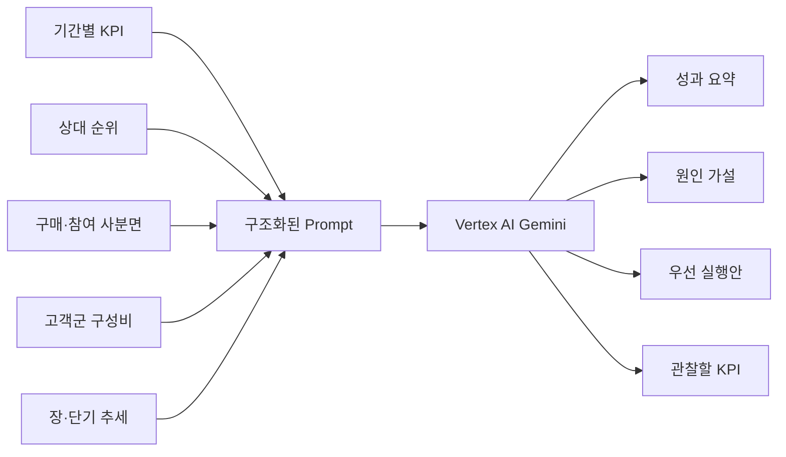

# AI 인사이트 설계

> 생성형 AI를 KPI 계산기가 아니라, 검증된 분석 결과를 실행 언어로 번역하는 해석 계층으로 사용합니다.

[← 메인 README로 돌아가기](../README.md)

---

## AI가 받는 정보



| AI 입력 | AI가 답하는 질문 |
|---|---|
| 유입·매출·전환·객단가 | 현재 성과의 크기와 질은 어떤가 |
| 전체 및 사분면 내 순위 | 절대값이 아닌 상대적 위치는 어떤가 |
| UX×구매·UX×참여 유형 | 이 이벤트가 맡는 퍼널 역할은 무엇인가 |
| 고객군별 구성비 | 어떤 행동 성향의 고객이 결과를 만들었는가 |
| 3개월·1개월·주차 흐름 | 일시적인 변화인가, 지속되는 추세인가 |

## 인사이트 계층

| 유형 | 목적 |
|---|---|
| `3_MONTH` | 장기 베이스라인과 구조적인 강점·약점 파악 |
| `1_MONTH` | 최근 캠페인 효과와 단기 변화 파악 |
| `1_WEEK` | 급격한 변화와 이상 신호 감지 |
| `TOTAL` | 기간별 증거를 종합해 최종 우선순위 제안 |

기간별 인사이트를 따로 생성한 뒤 `TOTAL`에서 흐름을 종합합니다.

```text
3개월 성과 우수 + 최근 1개월 하락
→ 장기적으로 검증됐지만 최근 피로도가 발생한 이벤트

3개월 성과 낮음 + 최근 1개월·주차 상승
→ 절대 성과는 작지만 성장 가능성이 나타나는 이벤트
```

## 출력 원칙

좋은 인사이트는 설명에서 멈추지 않고 의사결정으로 이어져야 합니다.

```text
관찰 사실 → 비교 기준 → 가능한 원인 → 권장 액션 → 확인할 KPI
```

예를 들면 다음과 같습니다.

> UX는 같은 기간 평균보다 높지만 구매 전환은 하위권입니다. 관망 성향 고객 비중이 높아 콘텐츠 관심이 결제로 이어지지 않는 패턴입니다. 가격 할인 범위를 넓히기 전에 CTA 위치와 혜택 명료성을 우선 테스트하고, 다음 주 구매 전환율과 결제 시작률을 함께 관찰하는 것이 적절합니다.

## 신뢰성을 위한 책임 분리

| SQL이 담당 | AI가 담당하지 않는 것 |
|---|---|
| KPI 계산 | 원천 로그에서 임의로 숫자 추정 |
| 기간별 평균과 순위 | 이벤트의 상대 순위 재계산 |
| 고객군 구성비 | 존재하지 않는 고객군 생성 |
| 사분면 분류 | 정해진 분류 기준 임의 변경 |
| 기간 비교 데이터 생성 | 없는 기간의 추세 추정 |

AI는 입력된 지표 범위 안에서만 설명하며, 관찰된 사실과 원인 가설을 구분하도록 설계합니다.

## 인사이트 작성 규칙

### 수치를 반복하지 않고 의미를 설명합니다

```text
나쁜 예
유입은 1,200명이고 구매 전환율은 3.2%입니다.

좋은 예
유입은 상위권이지만 구매 전환은 평균 이하로,
트래픽 규모가 매출로 충분히 연결되지 않고 있습니다.
```

### 항상 비교 기준을 포함합니다

- 전체 이벤트 평균 대비
- 동일 사분면 이벤트 대비
- 이전 기간 대비
- 유입 순위 대비 매출 순위
- UX 순위 대비 전환 순위

### 원인은 단정하지 않습니다

```text
“가격이 비싸서 전환되지 않았다” (X)

“UX 대비 구매 전환이 낮으므로,
가격·혜택 명료성 또는 결제 CTA가 병목일 가능성이 있다” (O)
```

### 액션에는 확인 지표를 포함합니다

| 액션 | 함께 볼 KPI |
|---|---|
| CTA 변경 | 결제 시작률, 다음 여정 이동률 |
| 혜택 문구 변경 | 구매 전환율, 객단가 |
| 콘텐츠 개편 | 체류시간, 스크롤, IDS |
| 타기팅 변경 | 고객군 구성비, 유입 대비 구매자 비율 |
| 예산 확대 | 증분 매출, 구매 전환율 유지 여부 |

## 고객군 이름 생성

K-Means 군집 번호 자체에는 비즈니스 의미가 없습니다. 고객군별로 다음 프로필을 AI에 전달합니다.

- 고객 수
- 구매 횟수·매출·충성도 중앙값
- 세션·행동·클릭 중앙값
- 경로 깊이·스크롤·체류시간 중앙값
- 상호작용 밀도(IDS)와 구매 의도 비율(ISS) 중앙값

AI는 이를 바탕으로 짧은 고객군 이름, 행동 특징, 마케팅 시사점을 생성합니다.

```text
고객군 이름: 신중 탐색형

특징:
콘텐츠 탐색과 체류는 높지만 구매 의도 행동은 상대적으로 낮음

마케팅 시사점:
정보 비교 단계의 고객으로,
가격·후기·혜택 비교 콘텐츠와 다음 단계 CTA가 중요
```

군집 이름을 고정하지 않고 실제 프로필에 따라 갱신하므로, 고객 행동 변화가 세그먼트 해석에도 반영됩니다.

## 최종 가치

기존 대시보드가 “무슨 일이 있었는가”를 보여줬다면 AI 계층은 다음 질문에 답합니다.

- 왜 이런 결과가 나타났을 가능성이 있는가?
- 이 이벤트는 구매형인가, 탐색형인가?
- 성과 하락은 장기 문제인가, 최근 변화인가?
- 어떤 고객군이 현재 성과를 만들고 있는가?
- 지금 가장 먼저 실행할 액션은 무엇인가?
- 액션 이후 어떤 지표를 확인해야 하는가?

---

[데이터 모델 보기 →](data-model.md)

