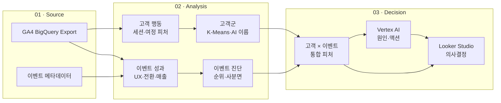
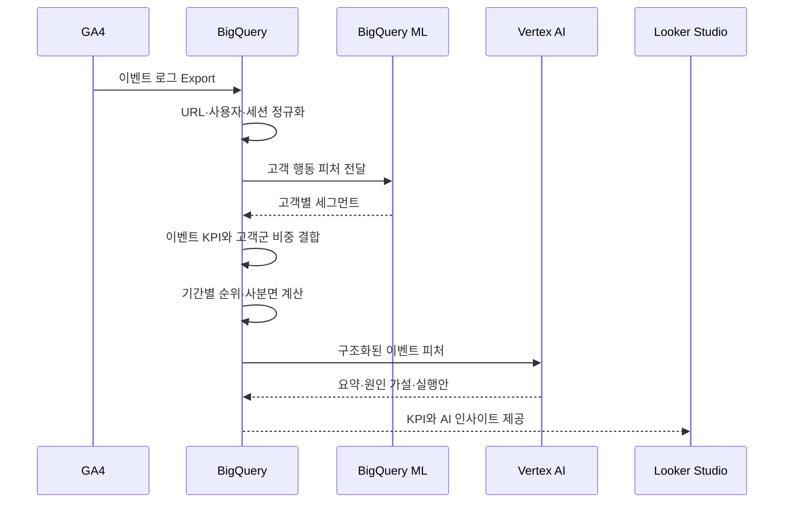
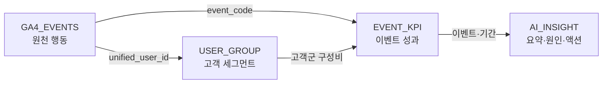

# 전체 시스템 구조

> GA4 원천 로그가 고객 이해, 이벤트 평가, AI 인사이트와 대시보드로 이어지는 전체 데이터 구조입니다.

[← 메인 README로 돌아가기](../README.md)

---

## 전체 아키텍처

## 실행 흐름

 

---

## 구성요소별 책임

| 구성요소 | 책임 |
|---|---|
| GA4 | 클릭, 스크롤, 영상, 다운로드, 회원가입, 구매 등 원천 행동 수집 |
| BigQuery SQL | 정제, 세션화, 피처 생성, KPI·평균·순위·사분면 계산 |
| BigQuery ML | 행동 기반 고객군 학습과 고객별 예측 |
| Vertex AI Gemini | 고객군 명명, 이벤트 성과 해석과 실행 액션 생성 |
| Looker Studio | 비교·필터·드릴다운이 가능한 의사결정 화면 |

## 파이프라인과 갱신 주기

| 파이프라인 | 갱신 | 산출물 |
|---|---|---|
| 고객 인텔리전스 | 분기 | 고객별 세그먼트 번호·이름 |
| 이벤트 인텔리전스 | 일 | 기간별 KPI, 순위, 사분면, 고객군 구성비 |
| AI 인사이트 | 이벤트 KPI 갱신 후 | 기간별 요약과 종합 실행안 |
| 대시보드 | 원천 테이블 갱신 후 | 이벤트 비교와 상세 분석 화면 |

 

---

## 데이터 모델

 

### 고객 세그먼트

SQL 기준 테이블은 `KPI_USER_GROUP_DATA`입니다.

| 컬럼 | 역할 |
|---|---|
| `quarter_id` | 세그먼트 생성 기준 분기 |
| `unified_user_id` | 통합 사용자 식별자 |
| `persona_group` | 최종 고객군 번호 |
| `persona_name` | 고객군 행동 프로필 기반 이름 |
| `updated_at` | 갱신 시각 |

### 이벤트 KPI

SQL 기준 적재 대상은 `KPI_EVENT_DATA`입니다.

| 영역 | 주요 컬럼 |
|---|---|
| 기간·식별 | `WDATE`, `period_type`, `start_date`, `end_date`, `EVENTCODE` |
| 성과 | `users`, `ux_score`, `s_cvr`, `i_cvr`, `rev`, `arppu` |
| 고객 구성 | `g1_pct` ~ `g6_pct`, `g1_name` ~ `g6_name` |
| 진단 | `s_quad`, `s_act`, `i_quad`, `i_act` |
| 상대 비교 | `users_rank`, `rev_rank`, `ux_rank`, `s_cvr_rank`, `i_cvr_rank` |

### AI 인사이트

이벤트 KPI와 AI 결과는 `EVENTCODE + period_type + 분석 기간`을 기준으로 연결합니다.

| 컬럼 | 역할 |
|---|---|
| `INSIGHT_TYPE` | `3_MONTH`, `1_MONTH`, `1_WEEK`, `TOTAL` |
| `AI_SUMMARY` | 이벤트 상태를 압축한 결론 |
| `AI_INSIGHT` | 근거, 원인 가설, 실행안 |
| `start_date`, `end_date` | 해석한 분석 범위 |

---

[분석 방법론 보기 →](methodology.md)
