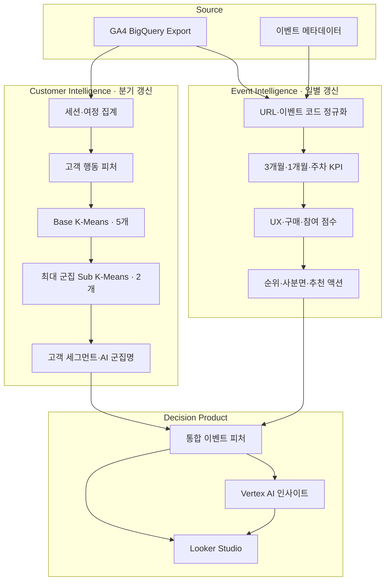
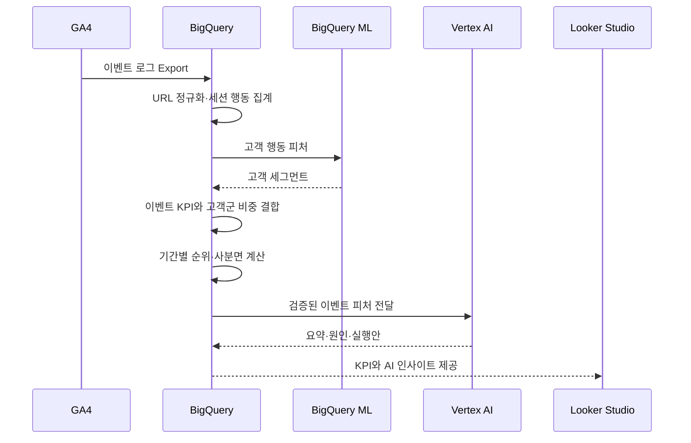

# 시스템 아키텍처

> GA4 원천 로그를 고객 행동과 이벤트 성과라는 두 갈래로 가공한 뒤, 하나의 의사결정 피처로 결합합니다.

[← 메인 README로 돌아가기](../README.md)

---

## 전체 구조

## 왜 두 파이프라인으로 나눴나

이벤트 KPI는 매일 달라지지만 고객 행동 세그먼트는 하루 단위로 크게 변하지 않습니다. 계산 비용과 운영 목적에 맞춰 갱신 주기를 분리했습니다.

| 파이프라인 | 갱신 단위 | 산출물 |
|---|---|---|
| 고객 인텔리전스 | 분기 | 고객별 세그먼트 번호·이름 |
| 이벤트 인텔리전스 | 일 | 기간별 KPI, 순위, 사분면, 고객군 구성비 |
| AI 인사이트 | 이벤트 KPI 갱신 후 | 기간별 요약과 종합 실행안 |

## 데이터 처리 순서

## 구성요소별 책임

| 구성요소 | 책임 |
|---|---|
| GA4 | 클릭, 스크롤, 영상, 다운로드, 회원가입, 구매 등 원천 행동 수집 |
| BigQuery SQL | 정제, 세션화, 피처 생성, KPI·순위·사분면 계산 |
| BigQuery ML | 고객 행동 기반 K-Means 학습과 예측 |
| Vertex AI Gemini | 군집 프로필 명명, 이벤트 성과 해석과 실행안 생성 |
| Looker Studio | 비교·필터·드릴다운이 가능한 의사결정 인터페이스 |

## 설계상 중요한 경계

### 계산과 해석의 분리

매출, 전환율, 순위, 사분면은 재현 가능한 SQL로 계산합니다. 생성형 AI는 수치를 새로 계산하지 않고, 이미 산출된 피처를 비즈니스 언어로 번역합니다.

### 고객과 이벤트의 결합

고객군 테이블은 `unified_user_id`로 세션 데이터에 연결됩니다. 이후 이벤트별로 각 고객군의 비중을 집계하므로 개인 수준 데이터가 대시보드에 직접 노출되지 않습니다.

### 상대 평가

이벤트마다 운영 기간과 규모가 다르므로 원시 값만 비교하지 않습니다. `period_type + start_date` 단위에서 평균과 순위를 계산해 동일한 분석 창 안에서 비교합니다.

---

[분석 로직 보기 →](analytics-logic.md)

