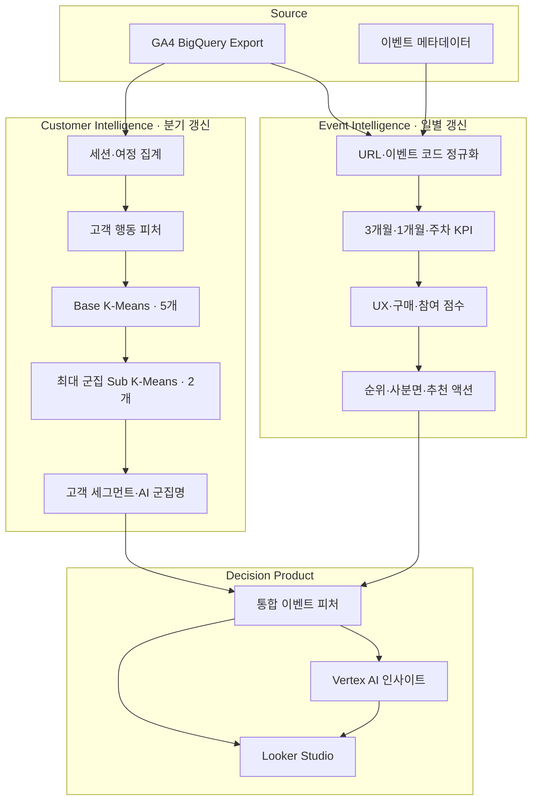
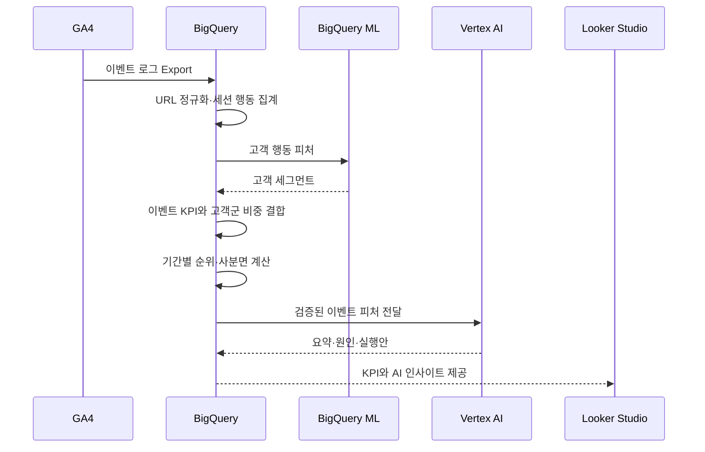
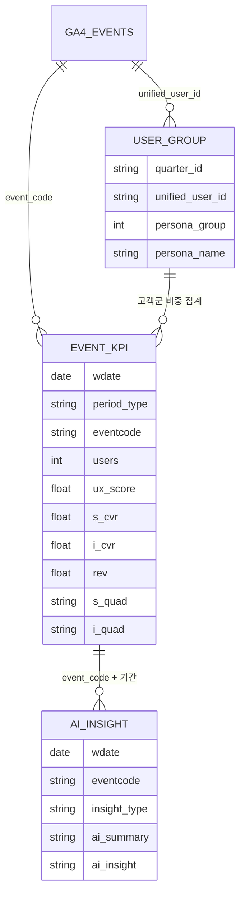

# 시스템 아키텍처

> GA4 원천 로그를 고객 행동과 이벤트 성과라는 두 갈래로 가공한 뒤, 하나의 의사결정 피처로 결합합니다.

[← 메인 README로 돌아가기](../README.md)

---

## 전체 구조

## 왜 두 파이프라인으로 나눴나

이벤트 KPI는 매일 달라지지만 고객 행동 세그먼트는 하루 단위로 크게 변하지 않습니다. 계산 비용과 운영 목적에 맞춰 갱신 주기를 분리했습니다.

| 파이프라인 | 갱신 단위 | 산출물 |
|---|---|---|
| 고객 인텔리전스 | 분기 | 고객별 세그먼트 번호·이름 |
| 이벤트 인텔리전스 | 일 | 기간별 KPI, 순위, 사분면, 고객군 구성비 |
| AI 인사이트 | 이벤트 KPI 갱신 후 | 기간별 요약과 종합 실행안 |

## 데이터 처리 순서

## 구성요소별 책임

| 구성요소 | 책임 |
|---|---|
| GA4 | 클릭, 스크롤, 영상, 다운로드, 회원가입, 구매 등 원천 행동 수집 |
| BigQuery SQL | 정제, 세션화, 피처 생성, KPI·순위·사분면 계산 |
| BigQuery ML | 고객 행동 기반 K-Means 학습과 예측 |
| Vertex AI Gemini | 군집 프로필 명명, 이벤트 성과 해석과 실행안 생성 |
| Looker Studio | 비교·필터·드릴다운이 가능한 의사결정 인터페이스 |

## 설계상 중요한 경계

### 계산과 해석의 분리

매출, 전환율, 순위, 사분면은 재현 가능한 SQL로 계산합니다. 생성형 AI는 수치를 새로 계산하지 않고, 이미 산출된 피처를 비즈니스 언어로 번역합니다.

### 고객과 이벤트의 결합

고객군 테이블은 `unified_user_id`로 세션 데이터에 연결됩니다. 이후 이벤트별로 각 고객군의 비중을 집계하므로 개인 수준 데이터가 대시보드에 직접 노출되지 않습니다.

### 상대 평가

이벤트마다 운영 기간과 규모가 다르므로 원시 값만 비교하지 않습니다. `period_type + start_date` 단위에서 평균과 순위를 계산해 동일한 분석 창 안에서 비교합니다.

---

## 데이터 모델

개인 행동, 이벤트 성과, AI 해석을 분리해 계산 책임과 사용 목적을 명확하게 관리합니다.

### 고객 세그먼트

SQL 기준 테이블은 `KPI_USER_GROUP_DATA`입니다.

| 컬럼 | 설명 |
|---|---|
| `quarter_id` | 세그먼트 생성 기준 분기 |
| `unified_user_id` | `user_id` 또는 `user_pseudo_id` 기반 통합 ID |
| `persona_group` | 최종 고객군 번호 |
| `persona_name` | 고객군 행동 프로필 기반 이름 |
| `updated_at` | 갱신 시각 |

이벤트 세션과 사용자 단위로 조인한 뒤, 개인 정보가 아닌 이벤트별 고객군 구성비로 집계합니다.

### 이벤트 KPI

SQL 기준 적재 대상은 `KPI_EVENT_DATA`입니다.

| 영역 | 주요 컬럼 | 역할 |
|---|---|---|
| 기간·식별 | `WDATE`, `period_type`, `start_date`, `end_date`, `EVENTCODE` | 이벤트와 분석 기간 식별 |
| 성과 | `users`, `ux_score`, `s_cvr`, `i_cvr`, `rev`, `arppu` | 유입·반응·전환·매출 측정 |
| 고객 구성 | `g1_pct` ~ `g6_pct`, `g1_name` ~ `g6_name` | 이벤트별 방문자 성향 설명 |
| 진단 | `s_quad`, `s_act`, `i_quad`, `i_act` | 구매·참여 관점 유형과 기본 액션 |
| 상대 비교 | `users_rank`, `rev_rank`, `ux_rank`, `s_cvr_rank`, `i_cvr_rank` | 동일 기간 전체 이벤트 내 위치 |

### AI 인사이트

이벤트 KPI와 AI 결과는 `EVENTCODE + period_type + 분석 기간`을 기준으로 연결합니다.

| 컬럼 | 설명 |
|---|---|
| `INSIGHT_TYPE` | `3_MONTH`, `1_MONTH`, `1_WEEK`, `TOTAL` |
| `AI_SUMMARY` | 이벤트 상태를 압축한 한 줄 결론 |
| `AI_INSIGHT` | 성과 근거, 원인 가설, 실행안 |
| `start_date`, `end_date` | 인사이트가 해석한 분석 범위 |

특정 이벤트를 선택하면 KPI, 사분면, 고객군 구성, 기간별 변화와 AI 인사이트가 함께 변경됩니다.

> 공개 저장소에서는 Google Cloud 프로젝트 ID, GA4 식별자, 사업부 코드, 실제 이벤트 URL과 사용자 식별 정보를 예시 값으로 치환합니다.

---

[분석 로직 보기 →](analytics-logic.md)
