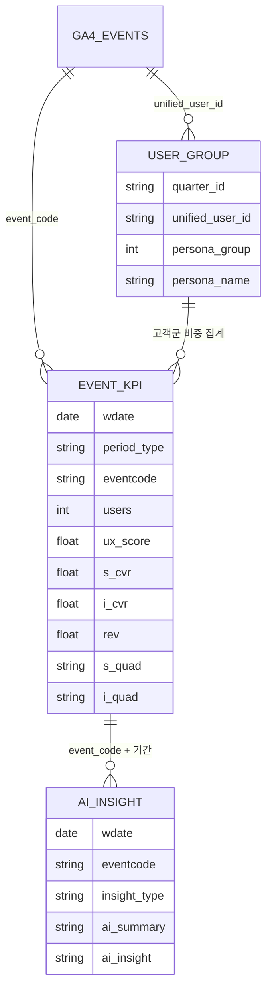

# 데이터 모델

> 개인 행동, 이벤트 성과, AI 해석을 분리해 계산 책임과 사용 목적을 명확하게 관리합니다.

[← 메인 README로 돌아가기](../README.md)

---

## 관계 구조



## 1. 고객 세그먼트 테이블

SQL 기준 테이블은 `KPI_USER_GROUP_DATA`입니다.

| 컬럼 | 설명 |
|---|---|
| `BSARK` | 사업 영역 식별 코드 |
| `BSARK_KOR` | 사업 영역 표시명 |
| `quarter_id` | 세그먼트 생성 기준 분기 |
| `unified_user_id` | `user_id` 또는 `user_pseudo_id` 기반 통합 ID |
| `persona_group` | 최종 고객군 번호 |
| `persona_name` | 고객군 행동 프로필 기반 이름 |
| `updated_at` | 갱신 시각 |

이 테이블은 고객별 세그먼트 결과를 저장하고, 이벤트 세션과 사용자 단위로 조인해 이벤트별 고객군 구성비를 계산하는 데 사용합니다.

## 2. 이벤트 KPI 테이블

SQL 기준 적재 대상은 `KPI_EVENT_DATA`입니다.

### 식별 및 분석 기간

| 컬럼 | 설명 |
|---|---|
| `WDATE` | 데이터 생성일 |
| `period_type` | `3_MONTH`, `1_MONTH`, `1_WEEK` |
| `start_date`, `end_date` | 분석 시작일과 종료일 |
| `EVENTCODE` | 이벤트 코드 |
| `EVENTNAME` | 이벤트 표시명 |
| `event_url` | 정규화된 이벤트 URL |

### 성과 지표

| 컬럼 | 설명 |
|---|---|
| `users` | 순 사용자 수 |
| `ux_score` | 행동·몰입·효율을 결합한 상대 UX 점수 |
| `s_cvr` | 구매 전환율 |
| `i_cvr` | 회원가입 및 다음 여정 기준 참여 전환율 |
| `rev` | 이벤트 직접 매출 |
| `arppu` | 구매 고객당 평균 매출 |

### 고객 구성

| 컬럼 | 설명 |
|---|---|
| `g1_pct` ~ `g6_pct` | 이벤트 방문자 중 고객군별 비중 |
| `g1_name` ~ `g6_name` | 각 고객군의 이름 |

### 사분면과 액션

| 컬럼 | 설명 |
|---|---|
| `avg_ux` | 같은 기간 전체 이벤트의 평균 UX 점수 |
| `avg_s_cvr` | 같은 기간 전체 이벤트의 평균 구매 전환율 |
| `avg_i_cvr` | 같은 기간 전체 이벤트의 평균 참여 전환율 |
| `s_quad`, `s_act` | UX×구매 전환 사분면과 기본 액션 |
| `i_quad`, `i_act` | UX×참여 전환 사분면과 기본 액션 |

### 상대 순위

| 컬럼 | 설명 |
|---|---|
| `users_rank`, `rev_rank` | 유입·매출 순위 |
| `ux_rank` | UX 점수 순위 |
| `s_cvr_rank`, `i_cvr_rank` | 구매·참여 전환 순위 |
| `arppu_rank` | 구매 고객당 평균 매출 순위 |
| `s_quad_users_rank`, `s_quad_rev_rank` | 구매 사분면 내부 유입·매출 순위 |
| `i_quad_users_rank`, `i_quad_i_cvr_rank` | 참여 사분면 내부 유입·참여 전환 순위 |

## 3. AI 인사이트 테이블

대시보드는 이벤트 KPI와 AI 결과를 이벤트 및 분석 기간을 기준으로 연결합니다.

| 컬럼 | 설명 |
|---|---|
| `WDATE` | 인사이트 생성일 |
| `EVENTCODE` | 이벤트 식별자 |
| `INSIGHT_TYPE` | 장기·단기·주차·종합 인사이트 유형 |
| `period_type` | KPI 분석 기간 |
| `start_date`, `end_date` | 분석 범위 |
| `AI_SUMMARY` | 한 줄 결론 |
| `AI_INSIGHT` | 성과 근거, 원인 가설, 실행안 |
| `IDX` | 대시보드 연결용 인덱스 |

### 인사이트 유형

| 값 | 설명 |
|---|---|
| `3_MONTH` | 최근 3개월 기준 장기 인사이트 |
| `1_MONTH` | 최근 1개월 기준 단기 인사이트 |
| `1_WEEK` | 주차별 변화 인사이트 |
| `TOTAL` | 여러 기간을 결합한 종합 인사이트 |

## 4. 테이블 연결 방식

```text
고객 세그먼트 → 이벤트 KPI
unified_user_id

이벤트 KPI → AI 인사이트
EVENTCODE + period_type + start_date + end_date
```

이벤트 세션과 고객 세그먼트를 연결한 뒤 이벤트별 고객군 비중으로 집계합니다. 대시보드에서는 특정 이벤트를 선택하면 KPI, 사분면, 고객군 구성, 기간별 변화, AI 인사이트가 함께 변경됩니다.

## 5. 공개 저장소에서의 주의사항

외부 공개 전 다음 정보는 예시 값으로 치환하는 것이 안전합니다.

- Google Cloud 프로젝트 ID
- GA4 Dataset 및 Property 식별자
- 사업부 코드
- 실제 이벤트 URL
- 실제 사용자 식별자
- 운영용 프롬프트
- Cloud Run 및 Scheduler 설정
- 기업 내부 테이블명

README에서는 기술 구조와 문제 해결 방식만 보여주고 실제 운영 식별 정보는 노출하지 않는 구성을 권장합니다.

