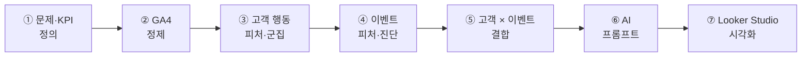

# 구축 과정과 기술적 의사결정

> 이벤트별 숫자를 나열하는 리포트를, 고객 맥락과 실행 액션을 제공하는 분석 제품으로 확장했습니다.

[← 메인 README로 돌아가기](../README.md)

---

## 핵심 변화

| 기존 리포트 | 분석 구조 개선 | AI 의사결정 지원 |
|:---:|:---:|:---:|
| 유입·매출·전환을 개별 확인 | 고객 행동과 이벤트 성과를 결합 | 근거·원인·액션을 자연어로 제공 |
| ↓ | ↓ | ↓ |
| **숫자의 의미를 사람이 재분석** | **이벤트의 역할과 고객 맥락 진단** | **검증 가능한 다음 액션 제안** |

## 구축 과정



## 핵심 의사결정

### 1. 페이지 단위가 아닌 세션·여정 단위로 집계

**문제**

페이지뷰만으로는 같은 페이지를 오래 탐색한 고객과 곧바로 이탈한 고객을 구분하기 어렵습니다.

**선택**

`사용자 × 세션 × 이벤트` 단위에서 클릭, 체류, 스크롤, 영상·파일 행동, 이전·다음 경로와 구매를 집계했습니다.

**결과**

유입 규모가 아니라 이벤트에서 어떤 행동이 발생했는지를 분석할 수 있게 됐습니다.

---

### 2. 원시 행동량을 그대로 군집에 넣지 않음

**문제**

구매·매출·클릭·세션 수는 분포와 단위가 달라 큰 값이 군집을 지배할 수 있습니다. 비정상적으로 짧거나 긴 세션도 고객 특성을 왜곡합니다.

**선택**

- 체류시간 3초 미만과 5,400초 초과 제외
- 긴 꼬리 분포에 `LOG10(x + 1)` 적용
- K-Means 입력값 표준화
- 선호 시간을 `sin/cos`로 변환

**결과**

단순 활동량보다 행동 패턴의 차이를 중심으로 고객을 구분할 수 있게 됐습니다.

---

### 3. 고정 고객 유형 대신 데이터 기반 계층형 군집

**문제**

고객 유형을 미리 정하면 실제 데이터가 기존 가설에 끼워 맞춰질 수 있습니다. 반대로 K-Means 한 번만 적용하면 가장 큰 군집 내부의 서로 다른 패턴이 가려질 수 있습니다.

**선택**

Base K-Means로 5개 군집을 만든 뒤, 가장 큰 군집만 Cosine Distance 기반 Sub K-Means로 재분할했습니다. 군집 이름은 고정하지 않고 프로필 중앙값을 바탕으로 AI가 생성하게 했습니다.

**결과**

데이터가 보여주는 행동 차이를 유지하면서 실무자가 이해할 수 있는 고객군을 만들었습니다.

---

### 4. 구매 전환과 참여 전환을 분리

**문제**

모든 이벤트를 구매 전환 하나로 평가하면 회원가입, 탐색, 다음 이벤트 이동을 만드는 상단 퍼널 이벤트가 실패로 분류됩니다.

**선택**

```text
구매 전환 = 구매 고객 / 유입 고객
참여 전환 = (회원가입 고객 + 다음 여정 고객) / 유입 고객
```

구매 관점과 참여 관점의 사분면을 각각 만들었습니다.

**결과**

매출형 이벤트와 탐색·리드형 이벤트를 서로 다른 역할로 평가할 수 있게 됐습니다.

---

### 5. 절대 기준이 아닌 기간별 상대 평가

**문제**

이벤트마다 운영 시기와 트래픽 규모가 다르기 때문에 고정된 전환율 기준으로 좋고 나쁨을 판단하기 어렵습니다.

**선택**

3개월·1개월·주차별 분석 창을 만들고, 같은 기간 전체 이벤트의 평균과 순위를 기준으로 UX×구매, UX×참여 사분면을 구성했습니다.

**결과**

이벤트의 절대 수치뿐 아니라 같은 시기에 운영된 다른 이벤트 안에서의 상대적 위치를 확인할 수 있게 됐습니다.

---

### 6. 고객 분석과 이벤트 분석을 분리한 뒤 결합

**문제**

이벤트 KPI만 보면 결과를 만든 고객이 누구인지 알 수 없고, 고객 군집만 보면 어떤 이벤트 성과와 연결되는지 알 수 없습니다.

**선택**

고객과 이벤트 파이프라인을 독립적으로 구성하고 `unified_user_id`를 기준으로 연결한 뒤, 최종적으로 이벤트별 고객군 구성비를 집계했습니다.

**결과**

“전환이 낮다”를 넘어 “탐색형 고객의 비중이 높아 관심이 구매로 연결되지 않을 가능성”처럼 원인 가설을 구체화할 수 있게 됐습니다.

---

### 7. 계산은 SQL, 해석은 AI

**문제**

AI에게 원천 데이터를 주고 KPI 계산까지 맡기면 숫자의 재현성과 설명의 신뢰성을 보장하기 어렵습니다.

**선택**

| BigQuery SQL | Vertex AI |
|---|---|
| KPI·평균·순위 계산 | 성과 요약 |
| 고객군 구성비 | 원인 가설 |
| 사분면 분류 | 실행 우선순위 |
| 기간별 비교 데이터 | 확인할 KPI 제안 |

AI가 입력에 없는 숫자를 생성하지 않고, 사실과 가설을 구분하며, 액션마다 검증 KPI를 제시하도록 프롬프트를 구성했습니다.

**결과**

분석은 재현 가능하게 유지하면서 결과를 실무자가 바로 이해할 수 있는 언어로 제공했습니다.

---

### 8. 데이터 변화 속도에 맞춰 갱신 주기 분리

**문제**

고객 세그먼트와 이벤트 KPI는 변화 속도가 다릅니다. 모든 데이터를 매일 다시 학습하면 비용이 커지고 군집명이 지나치게 자주 바뀔 수 있습니다.

**선택**

| 파이프라인 | 갱신 주기 |
|---|---|
| 고객 행동 군집과 고객군 이름 | 분기 |
| 이벤트 KPI·순위·사분면 | 일 |
| AI 이벤트 인사이트 | KPI 갱신 후 |

**결과**

고객 세그먼트의 안정성과 이벤트 성과의 최신성을 동시에 유지했습니다.

## 최종 사용자 경험

```text
이벤트 선택
    → 유입·UX·구매·참여·매출 확인
    → 같은 기간 전체 이벤트 내 위치 확인
    → 방문 고객군 구성 확인
    → 장기·단기·주차 변화 확인
    → AI 요약과 우선 액션 확인
```

실무자는 여러 보고서를 오가며 숫자를 다시 해석하지 않고, 한 화면에서 이벤트의 현재 위치와 다음 액션을 확인할 수 있습니다.

---

[분석 방법론 전체 보기 →](methodology.md)

