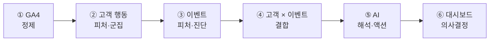
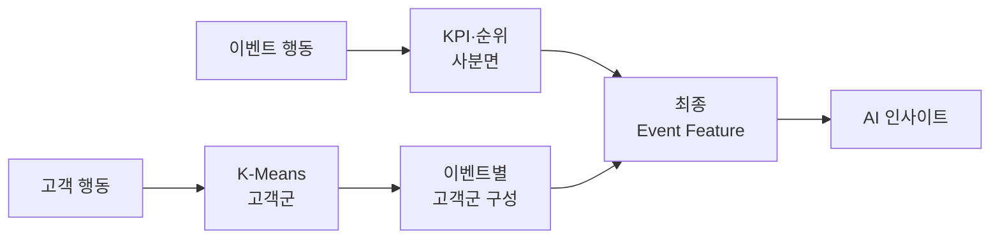
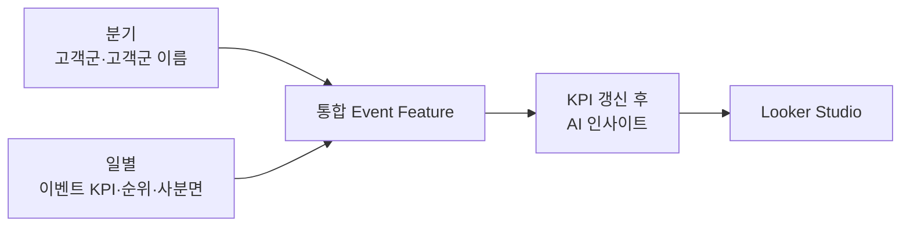
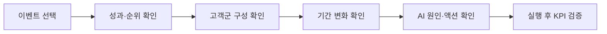

# 구축 과정과 기술적 의사결정

> 숫자를 보여주는 리포트에서, 고객 맥락과 다음 액션을 제공하는 분석 제품으로 확장했습니다.

[← 메인 README로 돌아가기](../README.md)

---

## 핵심 변화

| Before | Design | After |
|:---:|:---:|:---:|
| 유입·매출·전환을 개별 확인 | 고객 행동과 이벤트 성과를 결합 | 이벤트의 역할과 고객 맥락 진단 |
| 숫자의 의미를 사람이 재분석 | 계산과 AI 해석의 책임 분리 | 근거·액션·확인 KPI 자동 제안 |

## 구축 흐름



---

## 네 가지 설계 결정

| 의사결정 | 해결하려던 문제 | 선택 | 효과 |
|---|---|---|---|
| **행동량보다 행동 맥락** | 페이지뷰만으로 탐색과 이탈을 구분하기 어려움 | 사용자×세션×이벤트 단위 집계, 이상치 제거·로그 변환 | 체류·탐색·구매 패턴 중심의 고객 피처 |
| **고정 유형보다 데이터 기반 고객군** | 사전 정의 유형은 실제 행동을 왜곡할 수 있음 | Base K-Means 후 최대 군집만 2차 분할 | 행동 차이를 유지한 6개 고객군 |
| **구매만이 아닌 이벤트 역할 평가** | 상단 퍼널 이벤트가 낮은 구매율로 실패 처리됨 | 구매·참여 전환 분리, 기간별 상대 사분면 | 구매형·탐색형 이벤트를 별도 평가 |
| **계산과 해석의 책임 분리** | AI가 KPI까지 계산하면 재현성과 신뢰성이 낮아짐 | SQL은 계산, AI는 원인·액션 해석 | 검증 가능한 자연어 인사이트 |

[피처와 지표의 상세 계산 방식 보기 →](methodology.md)

---

## 고객과 이벤트의 결합



> 이벤트 KPI만으로는 알 수 없던 **‘어떤 고객이 이 성과를 만들었는가’**를 함께 설명합니다.

---

## SQL과 AI의 역할

| BigQuery SQL | Vertex AI |
|:---:|:---:|
| KPI·평균·순위 계산 | 핵심 성과 요약 |
| 고객군 구성비 집계 | 고객 맥락 기반 원인 가설 |
| 구매·참여 사분면 분류 | 실행 우선순위 제안 |
| 기간별 비교 데이터 생성 | 액션 이후 확인할 KPI 제시 |

```text
SQL이 검증된 사실을 생성
             ↓
AI가 사실의 의미와 다음 액션을 설명
```

---

## 갱신 주기



- **고객군:** 변화가 느리므로 분기별 갱신
- **이벤트 KPI:** 최신 성과 반영을 위해 일별 갱신
- **AI 인사이트:** KPI 계산 완료 후 생성

고객군의 안정성과 이벤트 성과의 최신성을 함께 유지하도록 주기를 분리했습니다.

---

## 최종 사용자 흐름



실무자는 여러 보고서를 오가지 않고, 한 화면에서 이벤트의 현재 위치와 다음 액션을 확인할 수 있습니다.

---

[분석 방법론 전체 보기 →](methodology.md)

