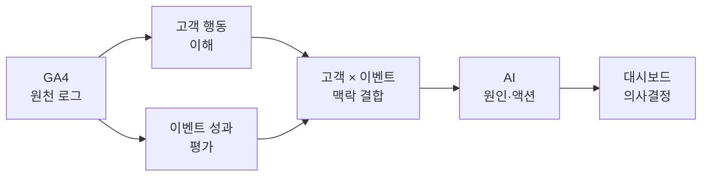
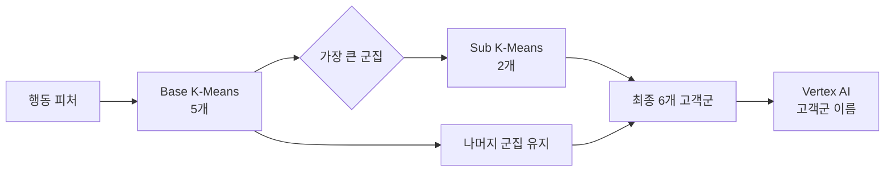
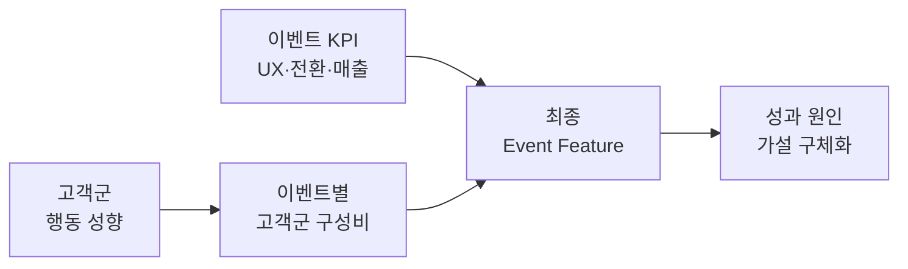

# 구축 과정과 기술적 의사결정

> 이벤트 성과를 보여주는 리포트에서, 성과의 배경과 다음 액션까지 설명하는 분석 제품으로 확장했습니다.

[← 메인 README로 돌아가기](../README.md)

---

## 프로젝트 목적

기존 리포트에서도 유입, 매출, 전환율은 확인할 수 있었습니다. 하지만 수치가 왜 그렇게 나왔는지, 어떤 이벤트를 확대하거나 개선해야 하는지는 담당자가 다시 분석해야 했습니다.

그래서 프로젝트의 목표를 **지표를 더 많이 보여주는 것”이 아니라 “판단에 필요한 맥락을 함께 제공하는 것**으로 정했습니다.



<br>

---

## 1. 페이지뷰를 ‘행동 맥락’으로 전환

> **페이지 조회 수 → 세션·여정 단위 행동 → 고객 행동 피처**

페이지뷰만으로는 콘텐츠를 오래 탐색한 고객과 곧바로 이탈한 고객을 구분하기 어렵습니다. 따라서 `사용자 × 세션 × 이벤트` 단위로 로그를 다시 집계했습니다.

- 클릭, 체류시간, 스크롤, 영상·파일 행동
- 이전·다음 이벤트 경로와 재진입
- 상품 조회, 장바구니, 결제 시작, 구매

구매·매출·클릭처럼 분포가 크게 치우친 값에는 로그 변환을 적용하고, 비정상적으로 짧거나 긴 세션은 제외했습니다. 선호 시간은 `sin/cos`로 변환해 자정 전후 시간이 수치상 멀어지는 문제도 보완했습니다.

**결과:** 단순 방문량이 아니라 고객의 탐색 깊이, 콘텐츠 반응과 구매 의도를 설명할 수 있는 피처를 만들었습니다.

<br>


---

## 2. 고객 유형을 정하지 않고 데이터에서 발견

> **사전 정의 고객 유형 → K-Means 행동 군집 → AI 기반 고객군 이름**

처음부터 ‘관망형’, ‘구매형’ 같은 유형을 정하면 실제 데이터를 기존 가설에 끼워 맞출 수 있습니다. 고객 유형을 미리 정하지 않고 BigQuery ML K-Means로 행동이 비슷한 고객을 먼저 묶었습니다.



가장 큰 군집은 서로 다른 다수 고객 패턴이 섞일 수 있어 한 번 더 분할했습니다. 이후 군집별 구매·매출·충성도·탐색 프로필을 AI에 전달해 실무자가 이해할 수 있는 이름을 생성했습니다.

**결과:** 분석자의 선입견보다 실제 행동 차이를 반영하면서, 비즈니스에서 바로 사용할 수 있는 고객군을 만들었습니다.

<br>


---

## 3. 이벤트를 매출 하나로 평가하지 않음

> **구매 전환만 평가 → 구매·참여 역할 분리 → 기간별 상대 평가**

모든 이벤트가 즉시 구매를 만드는 것은 아닙니다. 회원가입, 콘텐츠 탐색이나 다음 이벤트 이동을 만드는 상단 퍼널 이벤트는 구매 전환율만 보면 실패로 분류될 수 있습니다.

그래서 이벤트 성과를 두 관점으로 나눴습니다.

```text
구매 전환 = 구매 고객 / 유입 고객
참여 전환 = (회원가입 고객 + 다음 여정 고객) / 유입 고객
```

또한 고정된 기준 대신 3개월·1개월·주차별 전체 이벤트 평균과 순위를 기준으로 사분면을 구성했습니다.

| 이벤트 위치 | 해석 |
|---|---|
| UX ↑ · 전환 ↑ | 경험과 목적 행동이 모두 검증된 이벤트 |
| UX ↑ · 전환 ↓ | 관심은 높지만 다음 단계 설득이 약한 이벤트 |
| UX ↓ · 전환 ↑ | 탐색보다 목적 행동이 강한 이벤트 |
| UX ↓ · 전환 ↓ | 경험과 전환을 함께 개선해야 하는 이벤트 |

**결과:** 구매형 이벤트와 탐색·참여형 이벤트를 각자의 역할에 맞게 평가하고, 같은 시기에 운영된 이벤트 안에서 상대적 위치를 확인할 수 있게 됐습니다.

<br>


---

## 4. 고객 분석과 이벤트 분석을 다시 결합

> **고객군만으로도 부족하고, 이벤트 KPI만으로도 부족하다**

고객 군집만 보면 어느 이벤트에서 성과가 발생했는지 알 수 없고, 이벤트 KPI만 보면 어떤 고객이 그 결과를 만들었는지 알 수 없습니다.

두 분석을 독립적으로 만든 뒤 `unified_user_id`를 기준으로 연결하고, 이벤트별 고객군 구성비를 최종 피처에 포함했습니다.



예를 들어 유입이 많아도 탐색형 고객 비중이 높고 구매 전환이 낮다면, 단순히 “전환이 낮다”가 아니라 **관심이 구매로 이어지지 않는 설득 구간이 존재할 가능성**으로 해석할 수 있습니다.

**결과:** 이벤트의 성과와 그 성과를 만든 고객 맥락을 한 화면에서 함께 설명할 수 있게 됐습니다.

<br>


---

## 5. 계산은 SQL, 해석은 AI

> **AI가 숫자를 계산하지 않고, 검증된 숫자의 의미를 설명하게 했습니다.**

AI에게 원천 로그와 KPI 계산을 모두 맡기면 결과의 재현성과 신뢰성을 보장하기 어렵습니다. 따라서 두 도구의 책임을 명확하게 분리했습니다.

| BigQuery SQL | Vertex AI |
|:---:|:---:|
| KPI·평균·순위 계산 | 핵심 성과 요약 |
| 고객군 구성비 집계 | 고객 맥락 기반 원인 가설 |
| 구매·참여 사분면 분류 | 실행 우선순위 제안 |
| 기간별 비교 데이터 생성 | 액션 이후 확인할 KPI 제시 |

AI에는 원천 데이터가 아니라 SQL로 계산한 이벤트 피처만 전달했습니다. 프롬프트는 다음 순서로 답하도록 구성했습니다.

```text
관찰된 사실
    → 비교 기준
    → 가능한 원인
    → 우선 실행 액션
    → 확인할 KPI
```

**결과:** 계산은 재현 가능하게 유지하면서, 분석 결과를 실무자가 바로 이해하고 실행할 수 있는 언어로 제공했습니다.

<br>

---

## 최종 변화

```text
기존
지표 확인 → 사람이 원인 재분석 → 액션 결정

개선
이벤트 선택 → 성과·고객 맥락 확인 → AI 원인·액션 확인 → KPI 검증
```

실무자는 여러 보고서를 오가지 않고 한 화면에서 이벤트의 현재 위치, 방문 고객의 성향과 다음 액션을 확인할 수 있습니다.

---

[분석 방법론 전체 보기 →](methodology.md)

