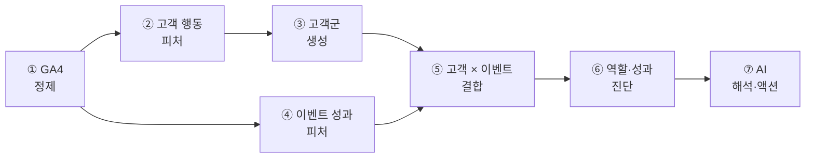
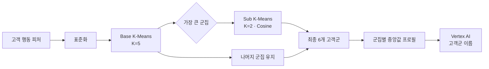
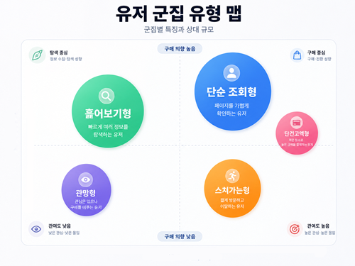
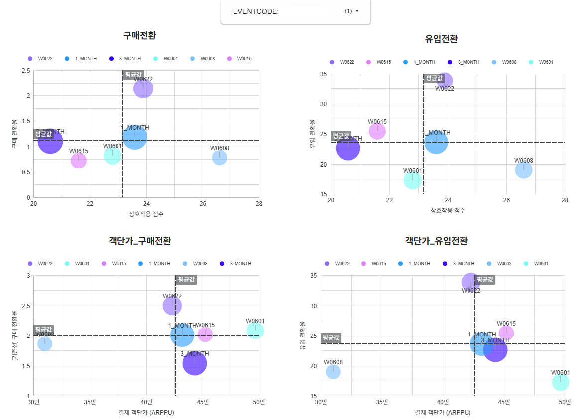
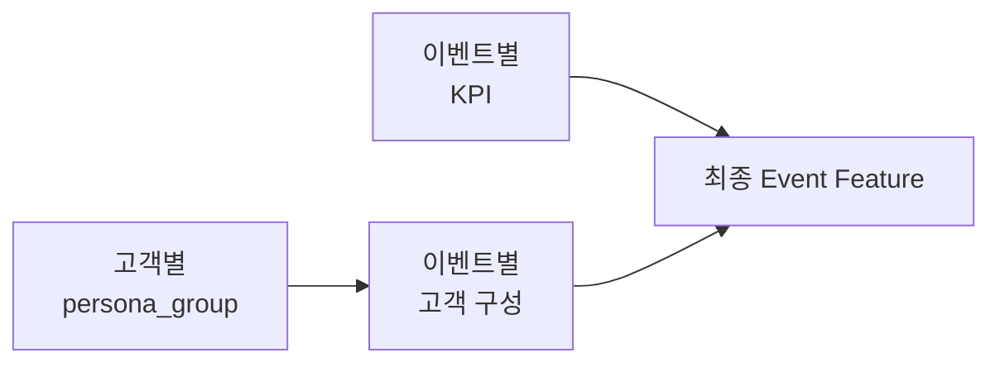
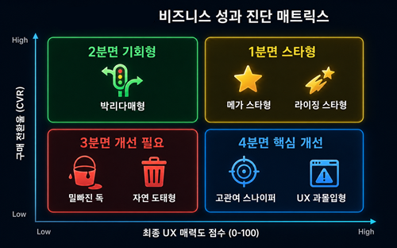
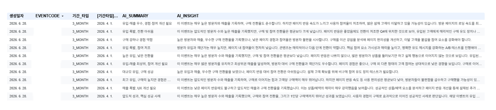

# 분석 방법론: 로그에서 AI 액션까지

> 고객을 이해하고, 이벤트를 평가하고, 두 결과를 결합한 뒤 AI가 실행안으로 번역하는 전체 분석 순서입니다.

[← 메인 README로 돌아가기](../README.md)

---

## 전체 타임라인



```text
고객 피처 생성
    → 행동 기반 고객군 생성
    → 이벤트 피처 생성
    → 이벤트별 고객군 구성 결합
    → 상대 순위와 사분면 진단
    → AI 프롬프트 구성
    → 실행 액션 생성
```

## 1. 고객 행동 피처 생성

GA4 이벤트를 `unified_user_id × session_id × event_code` 단위로 집계했습니다.

### 사용자와 세션 정규화

```sql
COALESCE(user_id, user_pseudo_id) AS unified_user_id
```

로그인 사용자는 `user_id`를 우선 사용하고, 값이 없으면 `user_pseudo_id`로 보완합니다. 세션은 GA4의 `ga_session_id`를 기준으로 구성합니다.

### 행동 맥락

| 관점 | 피처 |
|---|---|
| 고객 가치 | 구매 횟수, 누적 매출 |
| 충성도 | 활동 일수, 세션 수, 재진입 횟수 |
| 탐색 | 행동 수, 클릭 수, 경로 깊이 |
| 콘텐츠 반응 | 체류시간, 스크롤, 영상·파일 행동 |
| 의도 | 상품 조회, 장바구니, 결제 시작, 구매 비율 |
| 방문 맥락 | 신규 고객 여부, 랜딩 비율, 선호 시간 |

구매·매출·세션·행동량은 `LOG10(x + 1)`로 변환해 긴 꼬리 분포를 완화했습니다. 체류시간은 3초 미만과 5,400초 초과 값을 제외해 즉시 이탈과 비정상 장기 세션이 군집을 왜곡하지 않게 했습니다.

### 파생 지표

```text
IDS = (스크롤 + 클릭 + 영상 재생 + 파일 다운로드) / 체류시간
ISS = 의도 행동 수 / 전체 행동 수
```

- `IDS`는 제한된 시간 안에서의 상호작용 밀도입니다.
- `ISS`는 전체 행동 중 구매 의도 신호가 차지하는 비율입니다.

선호 시간은 `sin/cos` 순환형 피처로 변환해 자정 전후 시간이 수치상 멀어지는 문제를 피했습니다.

## 2. 행동 기반 고객군 생성



BigQuery ML의 K-Means로 5개 Base 군집을 만들고, 사용자가 가장 많이 모인 군집만 Cosine Distance 기반 K-Means로 한 번 더 분할했습니다.

한 개의 큰 군집 안에 서로 다른 다수 고객 패턴이 섞이는 문제를 완화하면서, 모든 군집을 무조건 잘게 나눠 해석력이 떨어지는 것도 피했습니다.

### 고객군 이름 생성

`cluster 1` 같은 번호만으로는 실무자가 고객 특성을 알 수 없습니다. 고객군별 구매, 매출, 충성도, 탐색 깊이, 스크롤, 체류, IDS·ISS 중앙값을 Vertex AI에 전달해 짧은 이름과 특징을 생성했습니다.

```text
입력
- 구매 중앙값: 낮음
- 세션·클릭: 높음
- 경로 깊이: 높음
- ISS: 낮음

출력 예시
- 이름: 신중 탐색형
- 특징: 여러 정보를 비교하지만 구매 의도 행동은 낮은 고객
```

이름을 미리 정해 결과에 끼워 맞추지 않고, 실제 군집 프로필에 따라 갱신할 수 있는 구조입니다.

### 고객군 결과 화면

<p align="center">
  
</p>

군집별 행동 차이와 고객 규모를 시각적으로 비교하고, 생성된 고객군 이름을 이벤트 분석에 다시 사용합니다.

## 3. 이벤트 성과 피처 생성

### 이벤트 URL과 코드 복원

운영 로그에는 URL 인코딩 값, 로그인 페이지의 `return_url`, 프로모션 접두어, 프로토콜이 생략된 URL이 섞여 있었습니다.

URL을 복원·정규화한 뒤 정규식으로 이벤트 코드를 추출하고 이벤트 메타데이터와 연결했습니다.

### 분석 기간

| 기간 | 목적 |
|---|---|
| `3_MONTH` | 장기 베이스라인 |
| `1_MONTH` | 최근 단기 성과 |
| `1_WEEK` | 주차별 변화 |

각 기간에서 이벤트별 사용자, 행동, 클릭, 체류, 스크롤, 구매자, 회원가입, 다음 여정, 매출과 객단가를 계산했습니다.

<p align="center">
  
</p>

장기·단기·주차 데이터를 함께 두어 현재 수치가 일시적인 변화인지 지속적인 추세인지 확인합니다.

### UX Score

행동 지표는 단위가 다르기 때문에 같은 기간의 이벤트 사이에서 Min-Max 정규화했습니다.

```text
행동 = 평균(행동 수, 클릭, 영상 재생, 파일 다운로드)
몰입 = 평균(체류시간, 스크롤)
효율 = 평균(IDS, 스크롤 효율)

UX Score = 평균(행동, 몰입, 효율)
```

UX Score는 절대적인 사용성 점수가 아니라, 같은 기간에 운영된 이벤트 사이의 상대적인 콘텐츠 반응 점수입니다.

### 전환 피처

```text
구매 전환율(s_cvr) = 구매 고객 / 유입 고객 × 100
참여 전환율(i_cvr) = (회원가입 고객 + 다음 여정 고객) / 유입 고객 × 100
ARPPU              = 매출 / 구매 고객
```

구매만 보면 상단 퍼널 이벤트가 과소평가될 수 있어 참여 전환을 별도로 정의했습니다.

## 4. 고객군과 이벤트 결합

고객군 결과를 `unified_user_id`로 이벤트 세션 데이터에 연결하고 이벤트별 고객군 구성비를 계산했습니다.



최종 화면에는 개인 데이터가 아니라 다음과 같은 집계 정보만 전달됩니다.

```text
이벤트 A
├─ 고객군 1 비중 / 이름
├─ 고객군 2 비중 / 이름
├─ ...
└─ 고객군 6 비중 / 이름
```

이를 통해 유입과 전환 수치 뒤에 있는 방문자 성향을 함께 해석할 수 있습니다.

## 5. 이벤트 역할과 성과 진단

동일한 `period_type + start_date` 안에서 전체 이벤트 평균과 순위를 계산했습니다.

<p align="center">
  
</p>

평균선을 기준으로 각 이벤트의 위치를 배치해 유입 규모만으로는 드러나지 않는 이벤트 역할을 구분합니다.

### 구매 관점

| 구분 | 해석 | 기본 액션 |
|---|---|---|
| UX ↑ · 구매 ↑ | 핵심 성과 이벤트 | 예산 집중 |
| UX ↑ · 구매 ↓ | 관심은 있으나 구매 설득 부족 | 혜택·CTA 강화 |
| UX ↓ · 구매 ↑ | 목적 구매 성향이 강함 | 단가·구성 최적화 |
| UX ↓ · 구매 ↓ | 경험과 전환이 모두 약함 | 개편 또는 종료 검토 |

### 참여 관점

`UX Score × i_cvr` 사분면을 별도로 만들어 구매보다 탐색·회원가입·다음 여정이 중요한 이벤트를 구분했습니다.

이와 함께 유입, 매출, UX, 구매 전환, 참여 전환, 객단가의 전체 순위와 사분면 내부 순위를 계산했습니다.

## 6. AI 해석과 프롬프트 설계

AI에는 원천 로그를 직접 전달하지 않습니다. SQL이 계산한 다음 피처만 구조화해 전달합니다.

```text
[이벤트]
- 이벤트 코드와 분석 기간

[성과]
- 유입, 매출, UX, 구매·참여 전환, 객단가

[상대 위치]
- 전체 이벤트 내 순위
- 구매·참여 사분면과 사분면 내부 순위

[고객 구성]
- 고객군 이름과 구성비

[시간 흐름]
- 3개월, 1개월, 주차별 변화
```

### 프롬프트의 사고 순서

```text
1. 관찰된 사실을 한 문장으로 요약한다.
2. 평균·순위·이전 기간과 비교한다.
3. 고객군과 사분면을 근거로 가능한 원인을 제시한다.
4. 가장 우선할 실행 액션을 제안한다.
5. 액션 이후 확인할 KPI를 지정한다.
```

### 프롬프트 가드레일

- 입력에 없는 숫자를 만들지 않는다.
- 관찰된 사실과 원인 가설을 구분한다.
- 이벤트의 역할을 고려해 구매만으로 실패를 판단하지 않는다.
- 포괄적인 조언보다 실행 가능한 한두 개 액션을 우선한다.
- 액션에는 반드시 검증할 KPI를 포함한다.

### 기간별 인사이트

| 유형 | 역할 |
|---|---|
| `3_MONTH` | 장기적인 강점과 구조적 약점 |
| `1_MONTH` | 최근 캠페인 효과와 단기 변화 |
| `1_WEEK` | 급격한 변화와 이상 신호 |
| `TOTAL` | 기간별 증거를 종합한 최종 우선순위 |

```text
관찰 사실 → 비교 기준 → 원인 가설 → 권장 액션 → 확인 KPI
```

정확한 계산은 SQL이 담당하고, AI는 검증된 결과를 비즈니스 언어와 실행안으로 번역합니다.

### AI 인사이트 결과

**유입 관점**

<p align="center">
  
</p>

**매출 관점**

<p align="center">
  
</p>

동일한 이벤트도 유입과 매출 관점에서 다른 질문을 던지며, 각 관점에 맞는 근거와 실행 액션을 제공합니다.

---

[구축 과정과 기술적 의사결정 보기 →](implementation.md)
