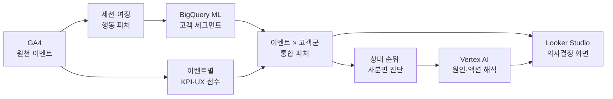

<div align="center">

# Event Intelligence

### GA4 로그를 “다음 마케팅 액션”으로 바꾸는 이벤트 분석 시스템

**행동 기반 고객 세그먼트 × 이벤트 KPI × 생성형 AI 인사이트**

<p>
  
  
  
  
  
</p>

</div>

---

## 숫자는 많았지만, 답은 없었습니다

기존 리포트는 유입·매출·전환율을 보여줬지만 **어떤 이벤트를 키우고, 무엇을 고쳐야 하는지**는 사람이 다시 해석해야 했습니다.

이 프로젝트는 GA4 원천 로그에서 고객 행동과 이벤트 특성을 동시에 만들고 결합해, 이벤트를 상대 평가한 뒤 AI가 **성과의 이유와 다음 액션**까지 제안하도록 설계했습니다.

> “매출이 낮다”에서 끝나지 않습니다.  
> **유입은 충분하지만 관망형 고객이 많고 구매 전환이 낮으니, 혜택·CTA를 강화한다**까지 연결합니다.

---

## 한눈에 보는 분석 흐름



| 01. 고객 이해 | 02. 이벤트 진단 | 03. 액션 제안 |
|:---:|:---:|:---:|
| 클릭·체류·스크롤·구매·여정을 피처화하고 고객군 생성 | UX, 구매·참여 전환, 매출, 고객 구성을 기간별 상대 평가 | AI가 성과 원인, 리스크, 우선 실행안을 자연어로 생성 |

---

## 결과 화면


<sub>
X축은 UX 상호작용 점수, Y축은 전환율, 버블 크기는 유입 규모입니다. 기간·이벤트·순위 조건으로 비교 대상을 좁힐 수 있습니다.
</sub>

### 한 화면에서 답하는 질문

- **Scale** — 유입과 매출이 큰 이벤트는 무엇인가?
- **Quality** — 방문자가 실제로 읽고, 클릭하고, 다음 여정으로 이동했는가?
- **Conversion** — 구매와 참여 중 어떤 목적에 강한 이벤트인가?
- **Audience** — 이 이벤트에는 어떤 행동 성향의 고객이 모였는가?
- **Action** — 예산 확대, 혜택 강화, 단가 조정, 개편 중 무엇을 먼저 할 것인가?

---

## 제가 설계한 핵심

### 1. 페이지뷰가 아닌 ‘행동 맥락’을 피처로 만들었습니다

세션별 클릭, 체류, 스크롤, 영상·파일 행동, 경로 깊이, 재방문, 구매와 매출을 집계했습니다. 시간대는 `sin/cos`로 변환해 23시와 0시가 멀어지는 문제를 피했습니다.

### 2. 고객군을 이벤트 성과에 다시 연결했습니다

BigQuery ML K-Means로 행동 기반 고객군을 만들고, 가장 큰 군집은 한 번 더 분할했습니다. 고객군별 프로필은 AI가 사람이 이해할 수 있는 이름으로 요약하며, 각 이벤트의 고객군 구성비가 최종 피처가 됩니다.

### 3. 절대값 대신 같은 기간의 전체 이벤트 안에서 비교했습니다

3개월·1개월·주차별 KPI를 만들고, 같은 기간의 전체 이벤트 평균과 순위를 기준으로 UX×구매, UX×참여 사분면을 구성했습니다. 이벤트 역할이 다른데 같은 잣대로 평가하는 오류를 줄였습니다.

### 4. AI는 계산하지 않고 ‘해석’하게 했습니다

KPI·순위·사분면·고객 구성·기간 추세는 SQL이 계산합니다. AI는 검증된 피처만 받아 원인, 기회, 다음 액션을 설명합니다. 수치 계산과 자연어 추론의 책임을 분리한 구조입니다.

---

## 기술적 하이라이트

```text
GA4 raw events
 ├─ URL 복원·이벤트 코드 정규화
 ├─ user_id / pseudo_id 통합
 ├─ 세션 행동·전환·여정 집계
 ├─ 고객 행동 피처 → K-Means 세그먼트
 ├─ 이벤트 KPI + 고객군 구성비
 ├─ Min-Max 정규화 → UX Score
 └─ 기간별 순위·사분면 → AI Insight → Dashboard
```

- 로그인 경유 URL의 `return_url`, 인코딩 값, 프로모션 접두어를 정규화해 이벤트 코드를 복원
- 체류시간 이상치 제외, 로그 변환, 표준화로 군집 입력값의 왜곡 완화
- `user_id`가 없을 때 `user_pseudo_id`를 사용해 분석 가능한 통합 식별자 구성
- 방문 규모가 큰 고객군을 2차 군집화해 대형 군집이 다른 행동 패턴을 삼키는 문제 보완
- UX 지표를 0–100으로 정규화해 서로 다른 단위의 행동을 하나의 비교 점수로 통합

---

## 프로젝트 문서

| 문서 | 이런 내용이 있습니다 |
|---|---|
| [아키텍처](docs/architecture.md) | 데이터가 GA4에서 대시보드까지 이동하는 전체 구조 |
| [분석 로직](docs/analytics-logic.md) | 고객 군집, UX 점수, 전환율, 사분면의 계산 원리 |
| [AI 인사이트 설계](docs/ai-insights.md) | AI 입력·출력, 책임 분리, 인사이트 생성 전략 |
| [데이터 모델](docs/data-model.md) | 핵심 테이블과 컬럼, 테이블 간 연결 관계 |

---

## 이 프로젝트가 보여주는 역량

**데이터 모델링** · GA4 로그 해석 · BigQuery SQL · 행동 피처 엔지니어링 · 비지도학습 · KPI 설계 · 생성형 AI 제품화 · 대시보드 스토리텔링

단순히 지표를 시각화하지 않고, **원천 로그 → 고객 이해 → 이벤트 평가 → 실행 의사결정**으로 이어지는 분석 제품 전체를 설계했습니다.

> 교육기업 데이터로 구현한 프로젝트이며, 공개 문서에서는 기업명과 운영 식별 정보를 비식별화했습니다.
